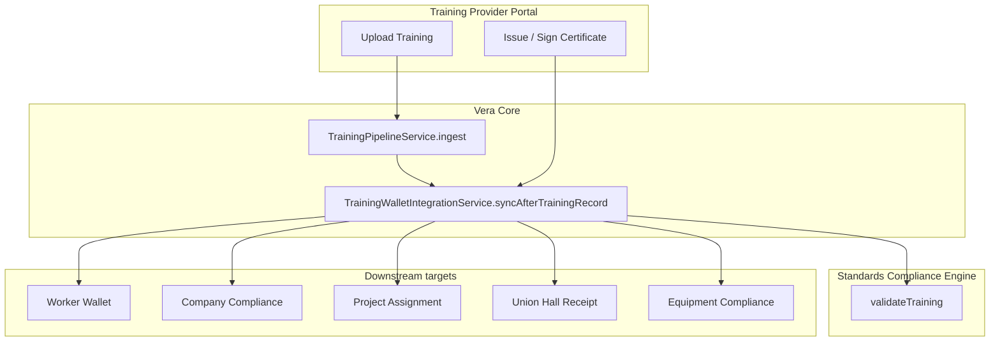

# Training Provider — Full System Integration

This document maps how the Training Provider stack connects to Vera Core, compliance, wallets, employers, projects, union halls, and equipment.

## Module registry (`backend/src/app.module.ts`)

| Module | Role |
|--------|------|
| `TrainingProviderCoreModule` | Provider CRUD, upload, certificates, access, portal API |
| `TrainingStandardsComplianceModule` | CSA/OHS validation engines, admin dashboard |
| `TrainingIngestionModule` | Bulk CSV/OCR ingest → `TrainingPipelineService` |
| `VeraCoreModule` | Wallet sync, pipeline, union hall training |
| `CompaniesModule` | Company + project training compliance dashboards |
| `VerificationModule` | Worker verify full (enriched certifications) |
| `QrModule` | Scan routing including certificate tokens |

## Architecture map



## Data flow: provider upload

1. **Provider portal** `POST /api/v1/training-providers/providers/:id/training/upload`
2. `TrainingProviderCoreService.uploadTraining` → `TrainingPipelineService.ingest`
3. QR token + `TrainingStandardsComplianceService.validateTraining`
4. `TrainingWalletIntegrationService.syncAfterTrainingRecord`:
   - Company link
   - `WorkerWalletItem` upsert (`trainingRecordId`)
   - Project assignment (if `projectId`)
   - Equipment compliance recalc
   - `CompanyTrainingComplianceService.refreshAfterTrainingRecord`
   - `UnionHallTrainingService.ensurePendingReceiptsForRecord` (union members)

## API surfaces

### Training Provider (`/api/v1/training-providers`)

- Portal: courses, instructors, upload, certificates, compliance, access onboarding
- Public: `GET /certificates/validate/:token`

### Training Standards (`/api/v1/training-standards`)

- `validate/training`, `validate/certificate`, dashboard, approve/reject workflows

### Vera Core (`/api/v1/core`)

- `POST /training/ingest` — generic ingest
- `GET /wallets/worker/:id` — wallet with enriched `training[]`
- Union hall: `training-dashboard`, `training/:id/accept|validate|push|reject`, `providers/link`

### Companies (`/companies`)

- `GET /:id/training-compliance` — employer dashboard
- `GET /:id/projects/:projectId/training-compliance` — project drill-down

### Verification (`/verify`)

- `GET /verify/worker/:id/full` — worker wallet UI (certifications = enriched training)

## Frontend routes

| Route | Purpose |
|-------|---------|
| `/provider-portal/*` | Provider admin + instructor portal |
| `/auth/provider-login` | Provider auth |
| `/admin/training-standards` | Global validation queue |
| `/companies/[id]` | Employer dashboard + `CompanyTrainingCompliancePanel` |
| `/companies/[id]/projects/[projectId]` | Project training compliance |
| `/union-hall/[id]` | Union hall + `UnionHallTrainingDashboard` |
| `/wallet/[workerId]` | Worker wallet (provider training cards) |
| `/verify/certificate/[token]` | Human certificate verify (QR target) |
| `/equipment/[id]/wallet` | Equipment wallet + training requirements tab |
| `/core/training-ingest` | Bulk ingestion UI |

## Database migrations (apply in order)

Resolve any failed migration before deploy.

| Migration | Contents |
|-----------|----------|
| `20260517040000_training_provider_module` | Provider, courses, instructors, roles |
| `20260517050000_training_standards_compliance` | Validation engine tables |
| `20260517060000_training_provider_access` | Instructor signing, JWT fields |
| `20260517070000_worker_wallet_training_link` | `WorkerWalletItem.trainingRecordId` |
| `20260517080000_union_hall_training_integration` | Union hall receipts + provider links |

```bash
cd backend
npx prisma migrate deploy
npx prisma generate
```

## API contract package

`packages/vera-api-contract/src/schemas/training-integration.ts` exports:

- `WalletTrainingRecordSchema`
- `CompanyTrainingComplianceDashboardSchema`
- `UnionHallTrainingDashboardSchema`
- `ValidateCertificatePublicResponseSchema`
- `EquipmentTrainingRequirementSchema`

## QR / certificate scan

- **QR payload URL:** `{PUBLIC_BASE_URL}/verify/certificate/{token}`
- **API validation:** `GET /api/v1/training-providers/certificates/validate/:token`
- **Parsers:** `qr-parse.util.parseCertificateToken`, `field-scan.parseSupervisorQrText` (kind `certificate`)
- **Supervisor scan:** routes to `/verify/certificate/{token}`

Env vars:

- `PUBLIC_BASE_URL` — frontend app URL for QR links (e.g. `https://app.vera.example`)
- `PUBLIC_API_URL` — backend URL for API-only clients

## Integration checklist

- [ ] Run all migrations; fix `20260517030000_notification_engine` if failed
- [ ] Seed training standards catalog (`TrainingStandardsComplianceModule` seed)
- [ ] Create training provider + approve (`ProviderApprovalStatus.APPROVED`)
- [ ] Assign `TRAINING_PROVIDER_ADMIN` user with `trainingProviderId`
- [ ] Upload training for worker with `companyId` / `projectId` as needed
- [ ] Confirm worker wallet shows provider fields + certificate QR
- [ ] Confirm company `/companies/:id` training compliance buckets
- [ ] Confirm project `/companies/:id/projects/:projectId`
- [ ] Link union hall provider; accept → validate → push training
- [ ] Scan certificate QR → `/verify/certificate/{token}`
- [ ] Equipment wallet → Training tab lists requirements

## Legacy / deprecated

- `backend/src/training-provider/provider.module.ts` — **not registered**; use `training-provider-core` only
- `GET /training-ingestion/csv` — prefer `/api/v1/training-ingestion/upload`
- `/training-provider` frontend route — employer compliance overview (not provider portal)

## Key source files

```
backend/src/modules/training-provider-core/
backend/src/modules/training-standards-compliance/
backend/src/modules/vera-core/training-pipeline.service.ts
backend/src/modules/vera-core/training-wallet-integration.service.ts
backend/src/modules/vera-core/training-wallet.mapper.ts
backend/src/modules/vera-core/union-hall-training.service.ts
backend/src/companies/company-training-compliance.service.ts
backend/src/training-ingestion/
vera-frontend/app/provider-portal/
vera-frontend/components/wallet/WorkerWalletView.tsx
vera-frontend/app/companies/[id]/CompanyTrainingCompliancePanel.tsx
vera-frontend/components/union-hall/UnionHallTrainingDashboard.tsx
packages/vera-api-contract/src/schemas/training-integration.ts
```
