# Vera Core — System Architecture Blueprint

Production architecture for Vera Core: workers, equipment, training, providers, union halls, companies, projects, compliance, wallets, inspections, competency, navigation, dashboard, field/offline mode, API platform, and background jobs.

**Stack:** Next.js frontend · NestJS backend · PostgreSQL (Prisma) · `@vera/api-contract` · IndexedDB field cache (client)

**Related:** [vera-core-platform.md](./vera-core-platform.md) · [verification-and-trust.md](./verification-and-trust.md) · [../api-contract.md](../api-contract.md)

---

## Section 1 — High-Level System Architecture

```mermaid
flowchart TB
  subgraph clients [Clients]
    WEB[Next.js App<br/>vera-frontend]
    MOB[Mobile / Field PWA]
  end

  subgraph edge [Edge]
    CDN[CDN / Static Assets]
    LB[Load Balancer]
  end

  subgraph frontend_layers [Frontend Layers]
    NAV[Navigation + Role Access]
    DS[Vera Core Components]
    DASH[Dashboard Widget Engine]
    FIELD[Field Mode + Offline Cache<br/>IndexedDB AES-256]
    API_CLIENT[API Client + Contract Parse]
  end

  subgraph api [API Layer REST]
    V1["/api/v1/*<br/>Api Platform"]
    LEGACY[Legacy routes<br/>/workers /companies /api/v1/core]
    AUTH[JWT Auth + RolesGuard]
  end

  subgraph backend [Backend Services]
    SVC[Domain Services<br/>vera-core equipment-core inspection reporting]
    REPO[Repositories<br/>api-platform + Prisma]
    VERIFY[Verification / Compliance Engine]
    QR[QR Service]
    SYNC[Field Sync + Dashboard Pipelines]
  end

  subgraph async [Async]
    EVT[EventBusService<br/>in-process]
    CRON[Schedulers<br/>@nestjs/schedule]
    JOBS[ApiPlatformScheduler<br/>expiry compliance dispatch]
  end

  subgraph data [Data]
    PG[(PostgreSQL)]
    FILES[File Storage<br/>uploads / S3-ready]
    REDIS[(Redis optional<br/>cache / rate limit)]
  end

  subgraph notify [Notifications]
    NOTIF[Notification Engine]
  end

  WEB --> CDN
  MOB --> CDN
  CDN --> NAV
  NAV --> DS
  DS --> DASH
  DS --> FIELD
  NAV --> API_CLIENT

  API_CLIENT -->|online| LB
  FIELD -->|offline queue| FIELD
  FIELD -->|sync when online| LB

  LB --> AUTH
  AUTH --> V1
  AUTH --> LEGACY

  V1 --> SVC
  LEGACY --> SVC
  SVC --> REPO
  SVC --> VERIFY
  SVC --> QR
  V1 --> SYNC

  REPO --> PG
  SVC --> FILES
  SVC --> EVT
  EVT --> NOTIF
  EVT --> JOBS
  CRON --> JOBS
  JOBS --> PG
  NOTIF --> PG

  style FIELD fill:#fef3c7
  style V1 fill:#dbeafe
  style VERIFY fill:#dcfce7
```

### Online vs offline paths

| Path | Flow |
|------|------|
| **Online** | UI → `apiGet`/`apiPost` → JWT → Controller → Service → Prisma → response envelope |
| **Offline** | UI → `LocalCacheStore` + `SyncQueue` → on reconnect → `POST /api/v1/sync/batch` → conflict resolver → domain APIs |
| **Compliance** | Read path may use cached summaries; write path always queued if offline |

---

## Section 2 — Entity Relationship Diagram (ERD)

Diagram maps **conceptual entities** (mega-prompt) to **Prisma models** (actual). Items marked *(computed)* are not separate tables.

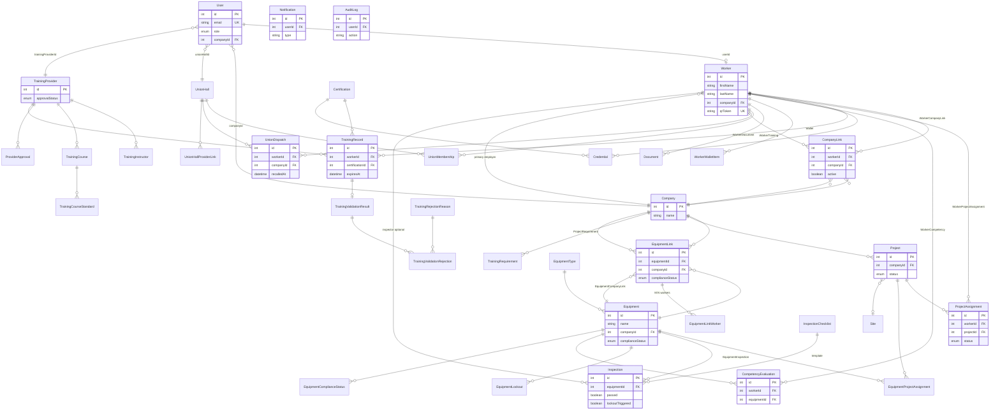

### Entity mapping notes

| Prompt entity | Prisma / implementation |
|---------------|-------------------------|
| WorkerContact | `Worker.phone`, `Worker.email` |
| WorkerDocument | `Document.workerId` |
| WorkerTraining | `TrainingRecord` |
| WorkerCompetency | `CompetencyEvaluation` |
| CompanyAdmin | `User` where `role = COMPANY_ADMIN` |
| CompanySettings | `Company` + `TrainingRequirement` per company |
| ProjectRequirement | `TrainingRequirement`, `EquipmentTrainingRequirement`, competency rules |
| ComplianceRule | `RuleEngine` + `TrainingStandard` + `JurisdictionRequirement` *(runtime)* |
| ComplianceResult | `VerificationService.evaluateWorkerCompliance()` *(computed)* |
| InspectionItem | JSON `checklist` on `Inspection` |
| Permission | `UserRole` enum + `role-access.ts` |
| SyncQueue | Client `lib/field` IndexedDB; server `FieldSyncService` |
| EventLog | `AuditLog` + `EventBusService` domain events |

### Cardinality summary

| Relationship | Cardinality |
|--------------|-------------|
| Worker ↔ Company (CompanyLink) | M:N via `CompanyLink` |
| Worker ↔ Project | M:N via `ProjectAssignment` |
| Equipment ↔ Company | M:N via `EquipmentLink` |
| Equipment ↔ Project | M:N via `EquipmentProjectAssignment` |
| Worker ↔ Training | 1:M `TrainingRecord` |
| Provider ↔ Course | 1:M `TrainingCourse` |
| UnionHall ↔ Worker | M:N `UnionMembership` |
| Inspection ↔ Equipment | M:1 |

---

## Section 3 — Module Interaction Map

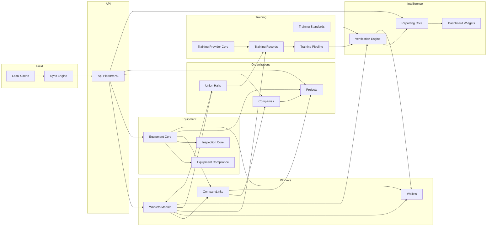

---

## Section 4 — Data Flow Diagrams (DFD)

### 4.0 Context (Level 0)

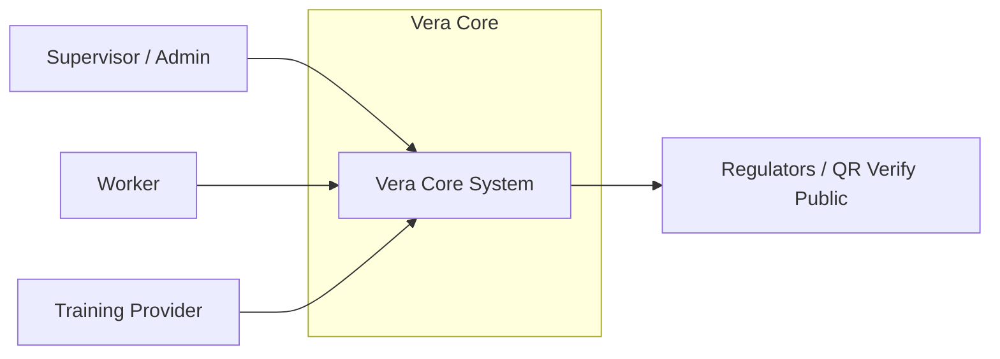

### 4.1 Worker onboarding (Level 1 → 2)

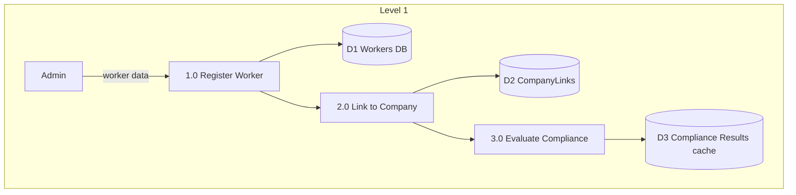

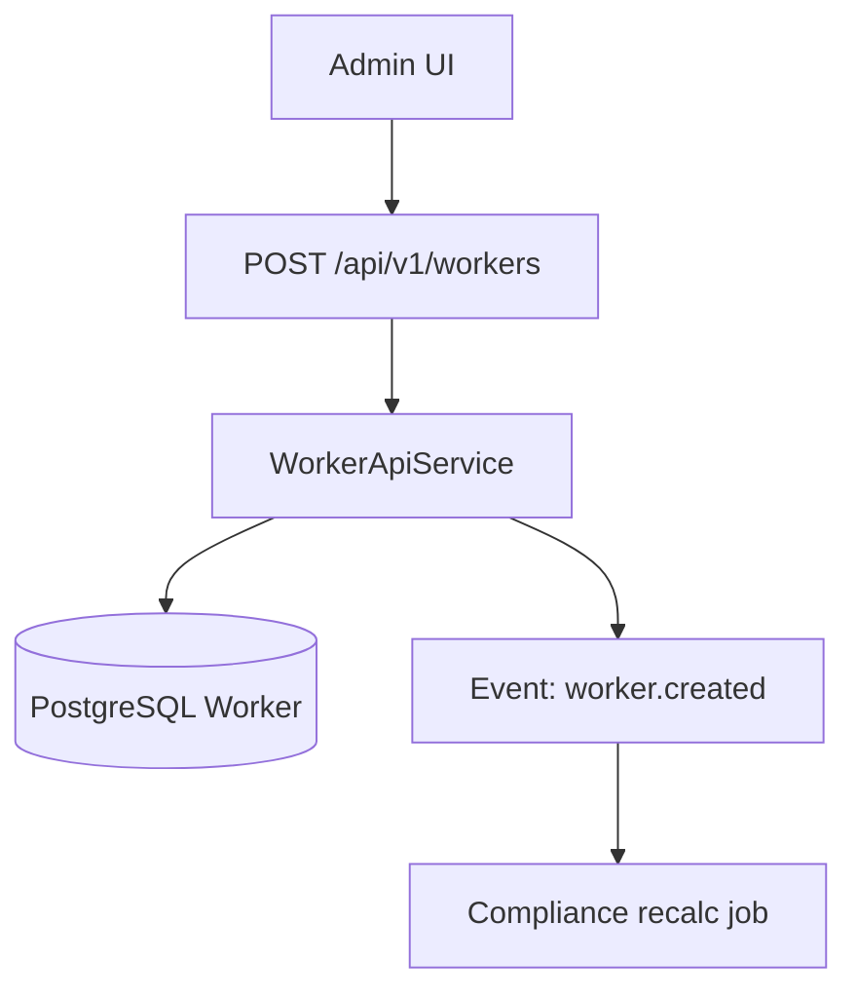

### 4.2 Equipment onboarding

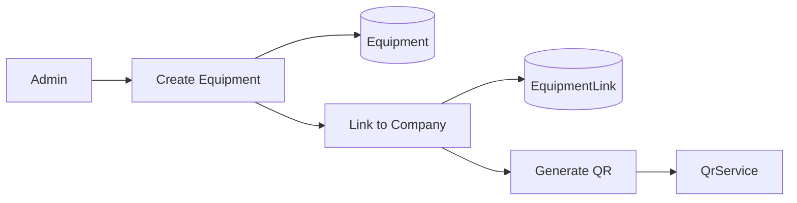

### 4.3 Training ingestion

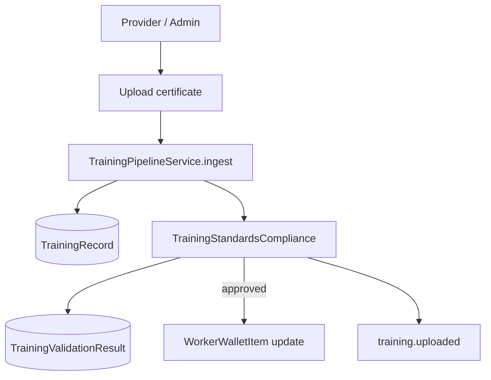

### 4.4 Compliance validation

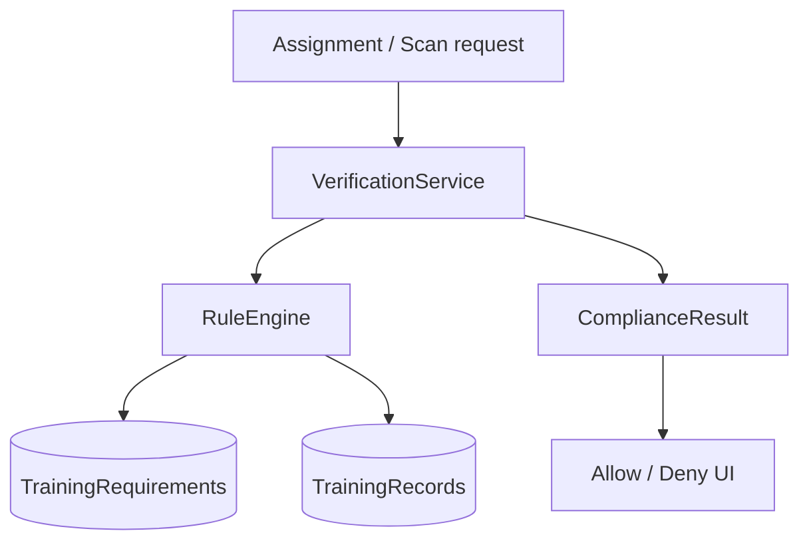

### 4.5 Project assignment

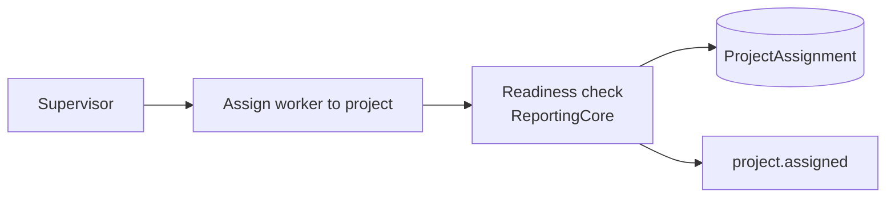

### 4.6 Inspection workflow

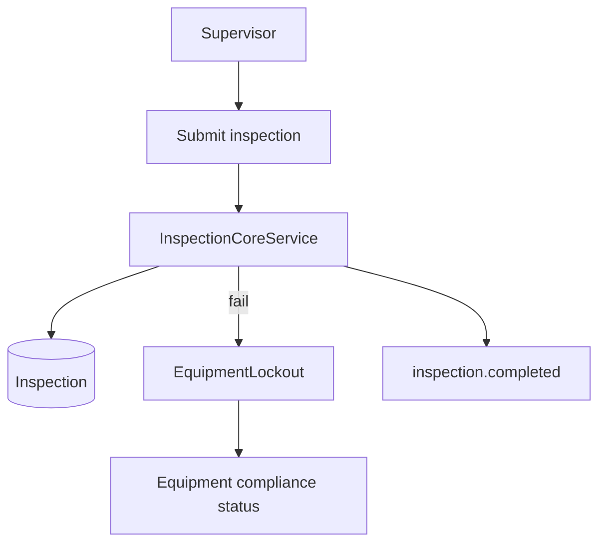

### 4.7 Competency evaluation

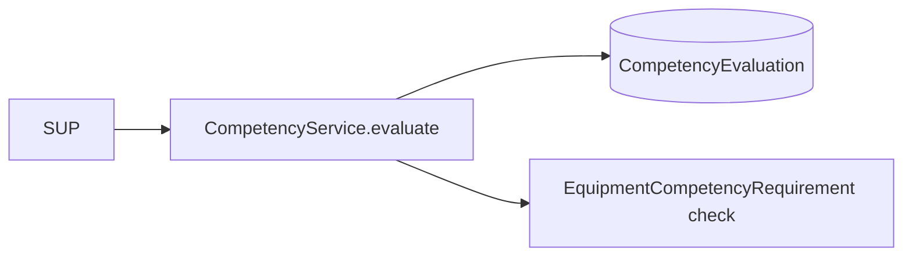

### 4.8 Provider training issuance

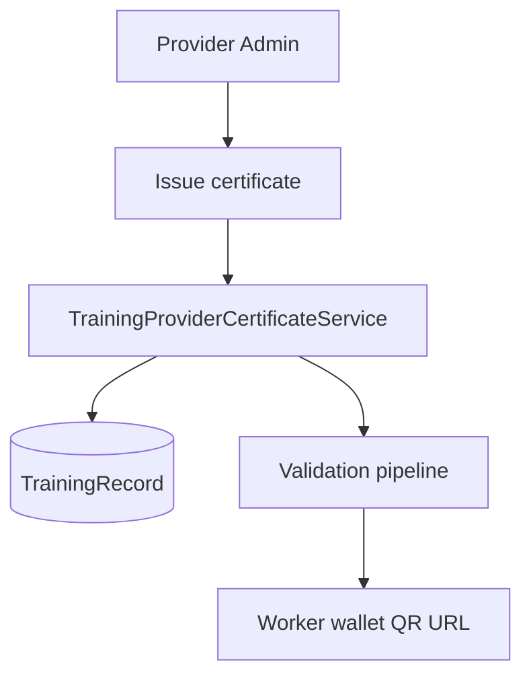

### 4.9 Offline → Online sync

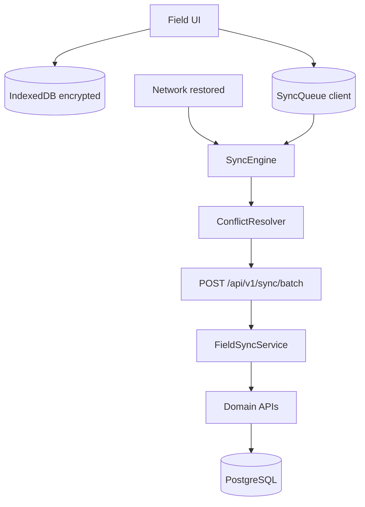

---

## Section 5 — Sequence Diagrams

### 5.1 Worker QR scan → Link to company

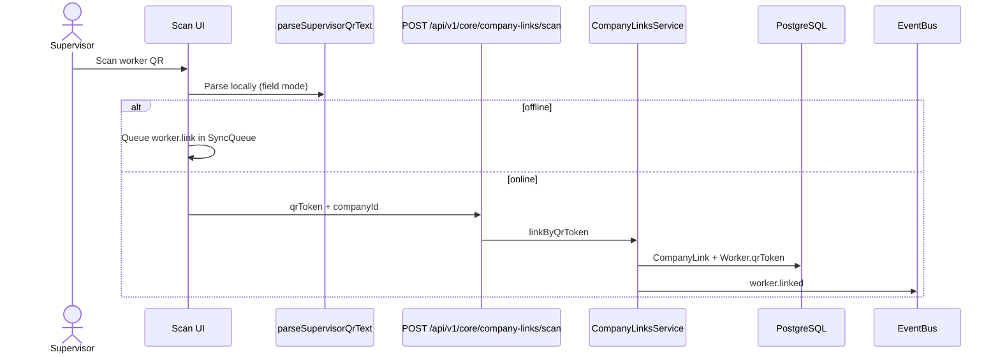

### 5.2 Equipment QR scan → Link to company

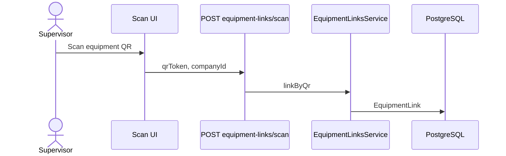

### 5.3 Upload training → Compliance → Wallet

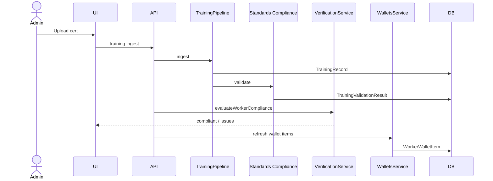

### 5.4 Assign worker to project → Readiness

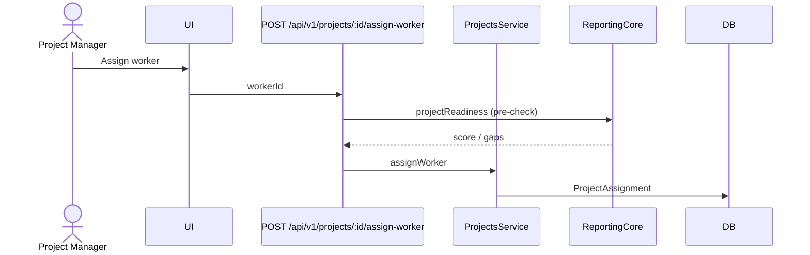

### 5.5 Pre-use inspection → Lockout

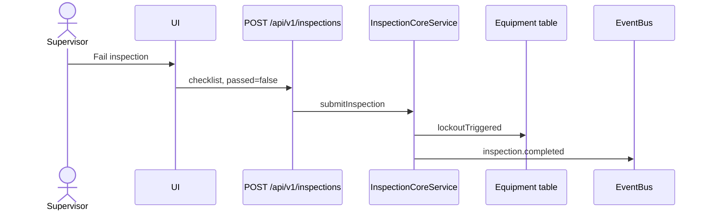

### 5.6 Offline inspection → Sync → Conflict resolution

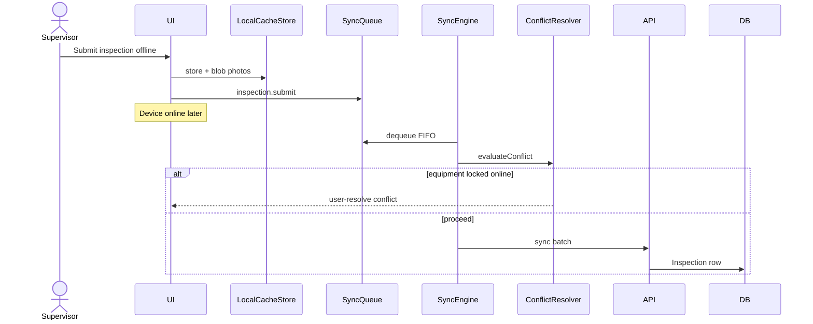

### 5.7 Provider issues training → Wallet update

```mermaid
sequenceDiagram
  actor PA as Provider Admin
  participant Portal
  participant API
  participant Cert as CertificateService
  participant Pipe as TrainingPipeline
  participant Wallet

  PA->>Portal: Issue certificate
  Portal->>API: issue + sign
  API->>Cert: signCertificate
  API->>Pipe: ingest record
  Pipe->>Wallet: wallet refresh
```

### 5.8 Dashboard load → Widget pipelines

```mermaid
sequenceDiagram
  actor User
  participant UI as WorkflowDashboard
  participant API as GET /api/v1/dashboard/widgets
  participant DWS as DashboardWidgetsService
  participant Pipes as Pipelines parallel
  participant DB

  User->>UI: Open /dashboard
  UI->>API: JWT role scope
  API->>DWS: getBundle(scope)
  par Worker compliance
    DWS->>Pipes: WorkerCompliancePipeline
    Pipes->>DB: workers + verification sample
  and Training expiry
    DWS->>Pipes: TrainingExpiryPipeline
    Pipes->>DB: TrainingRecord counts
  and Project readiness
    DWS->>Pipes: ProjectReadinessPipeline
    Pipes->>DB: projects + assignments
  end
  DWS-->>UI: widgets JSON
```

---

## Section 6 — Deployment Architecture

```mermaid
flowchart TB
  subgraph internet [Internet]
    USERS[Users / Field devices]
  end

  subgraph cdn_edge [CDN]
    CDN[CloudFront / Vercel Edge<br/>Next.js static + SSR]
  end

  subgraph vpc [Cloud VPC]
    LB[Application Load Balancer]

    subgraph api_tier [API Tier — autoscale]
      API1[NestJS API Pod 1]
      API2[NestJS API Pod 2]
    end

    subgraph worker_tier [Worker Tier]
      CRON[Cron / Scheduler Pod<br/>notification + api-platform jobs]
    end

    subgraph data_tier [Data Tier]
      PG[(PostgreSQL Primary)]
      PG_R[(Read Replica optional)]
      REDIS[(Redis<br/>sessions / cache)]
    end

    subgraph storage [Object Storage]
      S3[S3 / Blob<br/>uploads certificates photos]
    end
  end

  subgraph client_storage [Client]
    IDB[IndexedDB<br/>Field offline cache]
  end

  subgraph observability [Observability]
    LOG[Structured logs<br/>correlation-id]
    APM[APM / Metrics]
  end

  USERS --> CDN
  USERS --> IDB
  CDN --> LB
  USERS --> LB
  LB --> API1
  LB --> API2
  API1 --> PG
  API2 --> PG
  API1 --> PG_R
  API1 --> REDIS
  API1 --> S3
  CRON --> PG
  API1 --> LOG
  API1 --> APM
```

| Component | Technology | Notes |
|-----------|------------|-------|
| Frontend | `vera-frontend` Next.js 16 | `ThemeProvider`, `FieldModeProvider`, `VeraAppShell` |
| API | NestJS + Prisma | Global `JwtAuthGuard`, `HttpExceptionFilter` |
| DB | PostgreSQL | Single source of truth |
| Files | `uploads/` local; S3 in prod | `CoreFile`, training PDFs, inspection photos |
| Jobs | `@nestjs/schedule` | Co-located with API or separate worker deployment |
| Offline | Browser IndexedDB | Encrypted; no server-side queue table |

---

## Section 7 — Event-Driven Architecture

```mermaid
flowchart TB
  subgraph producers [Event Producers]
    WAPI[WorkerApiService]
    EAPI[EquipmentApiService]
    PAPI[ProjectApiService]
    INS[InspectionCore]
    PIPE[TrainingPipeline]
  end

  subgraph bus [EventBusService]
    EB((Event Emitter))
  end

  subgraph events [Domain Events]
    E1[worker.created]
    E2[worker.linked]
    E3[equipment.linked]
    E4[inspection.completed]
    E5[training.uploaded]
    E6[project.assigned]
    E7[project.closed]
    E8[compliance.recalc]
    E9[sync.batch]
  end

  subgraph handlers [Handlers]
    H1[ComplianceEventHandler]
    H2[NotificationEventHandler]
    H3[ApiPlatformScheduler]
    H4[AuditLog via services]
  end

  subgraph consumers [Downstream effects]
    COMP[Verification / Reporting recalc]
    NOTIF[NotificationEngine]
    DASH[Dashboard cache invalidation]
    SYNC[Field sync hints]
  end

  WAPI --> E1
  WAPI --> E2
  EAPI --> E3
  INS --> E4
  PIPE --> E5
  PAPI --> E6
  PAPI --> E7

  E1 --> EB
  E2 --> EB
  E3 --> EB
  E4 --> EB
  E5 --> EB
  E6 --> EB
  E7 --> EB

  EB --> H1
  EB --> H2
  H1 --> E8
  E8 --> COMP
  H2 --> NOTIF
  H1 --> DASH
  E9 --> SYNC
```

| Event | Typical handlers |
|-------|------------------|
| `worker.linked` | Compliance recalc, notifications |
| `inspection.completed` | Lockout alerts, compliance recalc |
| `training.uploaded` | Validation queue, wallet refresh, expiry jobs |
| `project.assigned` | Readiness notifications |
| `compliance.recalc` | ReportingCore overview refresh |

---

## Section 8 — Offline / Online Sync Architecture

### 8.1 Local cache schema (client)

```mermaid
erDiagram
  CACHE_ENTRY ||--o{ BLOB : "attachments"
  SYNC_QUEUE ||--o| CONFLICT : "optional"
  QR_REGISTRY ||--o| CACHE_ENTRY : "lookup"

  CACHE_ENTRY {
    string key PK
    string type
    int version
    string encryptedPayload
  }

  BLOB {
    string id PK
    bytes encryptedData
  }

  SYNC_QUEUE {
    string id PK
    string type
    string status
    int attempts
    json payload
  }

  QR_REGISTRY {
    string id PK
    string kind
    int entityId
  }
```

**Implementation:** `vera-frontend/lib/field/db.ts` — stores: `meta`, `cache`, `blobs`, `sync_queue`, `conflicts`, `qr_registry`.

### 8.2 Sync queue structure

```mermaid
stateDiagram-v2
  [*] --> pending: enqueue offline action
  pending --> syncing: SyncEngine picks up
  syncing --> synced: API success
  syncing --> pending: retryable error
  syncing --> failed: max retries / conflict
  failed --> pending: user retry
  synced --> [*]
```

**Action types:** `worker.link` · `equipment.link` · `project.assignWorker` · `inspection.submit` · `training.upload` · `qr.tempRecord`

### 8.3 Delta update flow

```mermaid
sequenceDiagram
  participant Client
  participant Preload as preloadFieldCache
  participant API
  participant Cache

  Client->>Preload: on login / field dashboard
  Preload->>API: GET workers, equipment, projects, checklists
  API-->>Preload: full snapshots
  Preload->>Cache: put with TTL + version
  Note over Client: Later: mutation offline
  Client->>Cache: read cached compliance for validation
  Client->>API: sync batch (delta actions only)
```

### 8.4 Conflict resolution flow

```mermaid
flowchart TD
  A[Sync item dequeued] --> B{evaluateConflict}
  B -->|auto proceed| C[executeSyncAction]
  B -->|block| D[save ConflictRecord]
  D --> E{resolution mode}
  E -->|user| F[Field UI prompt]
  E -->|admin| G[Admin review queue]
  C --> H{API result}
  H -->|ok| I[remove queue item]
  H -->|fail| J[retry with backoff]
```

**Rules (examples):** project closed → reject assignment; equipment locked out → block assign; worker removed → user-resolve training upload.

### 8.5 Background sync scheduler

```mermaid
flowchart LR
  subgraph triggers [Triggers]
    T1[navigator.onLine]
    T2[document.visibility visible]
    T3[Manual Sync now]
    T4[Interval 60s]
  end

  subgraph engine [DashboardRealtimeProvider + SyncEngine]
    SE[syncAll FIFO batch]
  end

  subgraph server [Server optional]
    CRON[ApiPlatformScheduler.syncQueueJob]
  end

  T1 --> SE
  T2 --> SE
  T3 --> SE
  T4 --> SE
  SE --> API[POST /api/v1/sync/batch]
```

### 8.6 Offline-first UI flow

```mermaid
flowchart TB
  START[App load] --> ONLINE{online?}
  ONLINE -->|no| FM[Field mode auto ON]
  ONLINE -->|yes| PRE[Preload cache]
  FM --> BANNER[Offline banner]
  PRE --> UI[Normal UI]
  BANNER --> UI
  UI --> ACT{user action}
  ACT -->|read| CACHE[Read LocalCacheStore]
  ACT -->|write| Q[Enqueue SyncQueue]
  Q --> BADGE[Pending sync badge]
  NET[Back online] --> SYNC[SyncEngine.syncAll]
  SYNC --> CLEAR[Clear pending / show conflicts]
```

---

## Appendix A — API surface map

| Domain | Primary v1 routes | Legacy / parallel |
|--------|-------------------|-------------------|
| Workers | `/api/v1/workers` | `/workers`, `/api/v1/core/workers` |
| Equipment | `/api/v1/equipment` | `/equipment`, `/api/v1/equipment` |
| Companies | `/api/v1/companies` | `/companies` |
| Projects | `/api/v1/projects` | `/api/v1/core/projects` |
| Compliance | `/api/v1/compliance` | `/api/v1/reporting` |
| Dashboard | `/api/v1/dashboard/widgets` | `/analytics`, reporting |
| Sync | `/api/v1/sync/batch` | `/api/v1/field/*` |
| Contracts | `/api/v1/contracts` | `@vera/api-contract` package |

## Appendix B — Key code locations

| Concern | Path |
|---------|------|
| Prisma schema | `backend/prisma/schema.prisma` |
| Api Platform | `backend/src/modules/api-platform/` |
| Vera Core hub | `backend/src/modules/vera-core/` |
| Reporting / compliance aggregates | `backend/src/modules/reporting-core/` |
| Verification engine | `backend/src/verification/` |
| Dashboard widgets | `backend/src/modules/dashboard-widgets/` |
| Field offline | `vera-frontend/lib/field/` |
| API contracts | `packages/vera-api-contract/` |
| Frontend platform client | `vera-frontend/lib/api/platform.ts` |

---

*This blueprint is the canonical structural reference for Vera Core. Update when schema or module boundaries change.*
