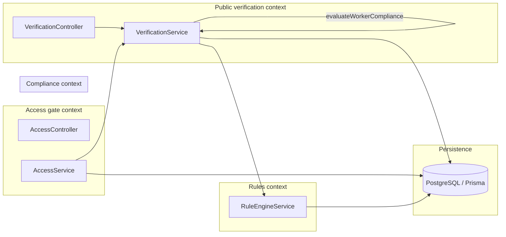
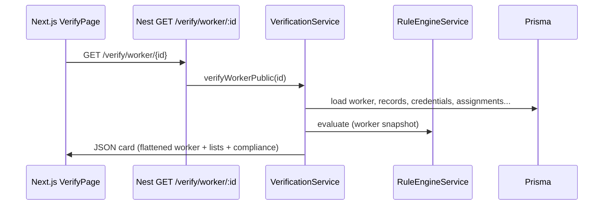
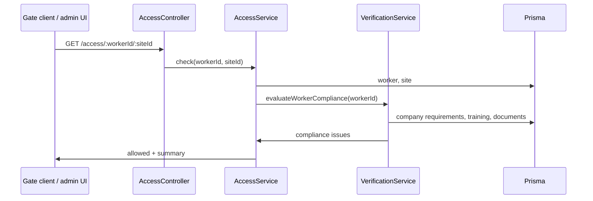

# Verification & trust — full architecture

This document expands the **verification** feature (QR checks, worker/equipment cards, site access) into an explicit architecture: boundaries, dependencies, data flow, and growth paths.

---

## 1. Business capabilities

| Capability | User-facing result | Primary backend surface |
|------------|----------------------|-------------------------|
| **Card verification** | Read-only proof of training, credentials, equipment state | `GET /verify/...` |
| **Compliance evaluation** | “Is this worker missing/expired training or documents per company rules?” | `VerificationService.evaluateWorkerCompliance` |
| **Deterministic safety rules** | Cross-check training, credentials, incidents for a worker + equipment | `RuleEngineService.evaluate` |
| **Site access decision** | Allowed/denied at a gate using compliance + (optionally) site rules | `GET /access/:workerId/:siteId` |
| **Investigation / incidents** | Separate bounded context; feeds **incidents** into rule engine over time | `IncidentsModule`, `SafetyWorkflowModule` |

---

## 2. Bounded contexts



**Principles**

- **Public verification** is intentionally **read-heavy** and **unauthenticated** (or weakly authenticated) for QR and kiosk flows. Treat responses as **non-authoritative** for high-risk actions; physical access should still use `Access` + org policy.
- **Compliance** encodes *company training requirements* vs *worker training records* and *documents*; it is the “policy engine” for “should this worker be considered compliant for training.”
- **Rule engine** is a **simpler, symmetric** check (missing cert IDs, expired rows, incident flags) used for quick SAFE/UNSAFE style results and demos.
- **Access** composes **compliance** (blocking issues) with **site + worker** presence; it can be extended with `WorkerSiteAccess` rows, time windows, and manual approval.

---

## 3. Layering (NestJS)

| Layer | Responsibility | Examples in this feature |
|-------|----------------|---------------------------|
| **HTTP** | Routing, validation, status codes | `VerificationController`, `AccessController` |
| **Application** | Orchestration, DTO mapping, use cases | `VerificationService`, `AccessService` |
| **Domain** | Invariants, enums, transition rules (today mostly inline in services) | Status transitions live in `SafetyWorkflowService` for incidents (adjacent feature) |
| **Infrastructure** | Prisma, future messaging, cache | `PrismaService` |

**Dependency direction:** Controllers → Application services → Prisma / Rule engine. **Access** depends on **Verification** for compliance evaluation (see module imports).

---

## 4. Sequence: verify worker (QR)



---

## 5. Sequence: site access check



**Note:** `AccessService` today treats “allowed” as **no blocking compliance issues**. You can extend this to require `WorkerSiteAccess.approved` and `status === ALLOWED` for defense in depth (see Prisma `WorkerSiteAccess`).

---

## 6. Data model touchpoints

Core Prisma models involved in verification and access:

- **Worker**, **Company**, **TrainingRequirement**, **TrainingRecord**, **Certification**, **Credential**, **Document**
- **Equipment**, **EquipmentAssignment**, **Incident** (rule engine)
- **Site**, **WorkerSiteAccess** (future stricter access)

ER details live in `backend/prisma/schema.prisma` and `backend/prisma/erd/` if generated.

---

## 7. HTTP surface (catalog)

### Verification (`/verify`)

| Method | Path | Purpose |
|--------|------|---------|
| GET | `/verify/worker/:id` | Public worker card |
| GET | `/verify/worker/:id/full` | Full payload (internal/heavy) |
| GET | `/verify/equipment/:id` | Equipment card |
| GET | `/verify/equipment/:id/full` | Full equipment |
| GET | `/verify/combined?worker=&equipment=` | Combined check |
| GET | `/verify/cert/:id` | Certification definition |
| GET | `/verify/training/:id` | Training record |
| GET | `/verify/credential/:id` | Credential |
| GET | `/verify/company/:id` | Company summary |
| GET | `/verify/site-access/:token` | Token `workerId-siteId` |

### Access (`/access`)

| Method | Path | Purpose |
|--------|------|---------|
| GET | `/access/:workerId/:siteId` | Compliance-based allow/deny |

### Identity verification (optional parallel API)

Under `identity-verify` / legacy routes — not the same as public `/verify` cards; document separately if you expose both.

---

## 8. Frontend contract

- **Base URL:** `NEXT_PUBLIC_API_URL` (e.g. `http://localhost:3001`).
- **Verify pages:** `vera-frontend/app/verify/**` use `components/VerifyPage.tsx` → `GET /verify/{endpoint}/{id}`.
- **Site access UI:** may call `/access/...` or use `/verify/site-access/{workerId-siteId}` depending on product choice.

---

## 9. Cross-cutting concerns

| Concern | Current state | Target direction |
|---------|---------------|------------------|
| **Auth** | Public verify endpoints often unauthenticated | Add optional API keys, signed QR tokens, or short-lived JWT for sensitive sites |
| **Rate limiting** | Not described in code | Add per-IP / per-token limits on `/verify` and `/access` |
| **Audit** | Incidents and chat may have audit | Emit domain events for “verification viewed” / “access denied” for compliance trails |
| **PII** | Worker names on cards | Redact or aggregate for public URLs where required |

---

## 10. Evolution roadmap

1. **Module boundaries:** `AccessModule` imports `VerificationModule` only (no duplicate `VerificationService` registration). Single instance of compliance logic.
2. **Policy service:** Extract `evaluateWorkerCompliance` interfaces into a dedicated `CompliancePolicy` port if multiple implementations (jurisdictions, tenants).
3. **Read models:** Materialize “verification snapshot” for offline QR or CDN-backed static cards.
4. **Events:** `VerificationRequested`, `AccessDenied` → queue → analytics and SOC dashboards.
5. **Explicit site policy:** Merge `WorkerSiteAccess` + compliance + equipment-specific requirements in one `AccessDecision` object.

---

## 11. Folder map (backend)

```
backend/src/
  verification/          # Public verify HTTP API + worker/equipment orchestration
  access/                # Site access use case (depends on verification)
  rules/                 # RuleEngineService
  compliance/            # Related compliance endpoints if any
  prisma/                # Global Prisma
```

This architecture is **intentionally incremental**: it documents what exists and names the seams for the next refactors without requiring a big-bang rewrite.
