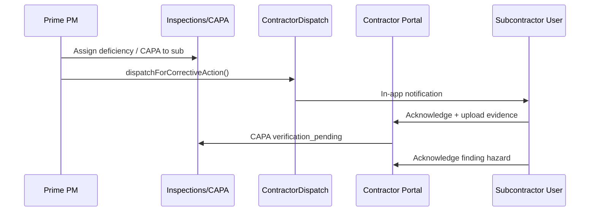

# Contractor Safety Portal — Architecture

## Purpose

Give subcontractor companies a dedicated surface to close the loop on safety work assigned by the prime contractor: corrective actions, inspection findings, crew compliance, and two-way communication.

## Data model

| Table | Purpose |
|-------|---------|
| `pm_contractor_portal_membership` | Links prime ↔ subcontractor (optional `project_id`) |
| `pm_contractor_finding_acknowledgment` | Contractor acknowledgment per inspection deficiency |
| `pm_contractor_portal_message` | Threaded messages between prime and contractor |

Reuses existing:

- `pm_inspection_contractor_dispatch` — CAPA packages sent to subcontractors
- `corrective_actions.subcontractor_company_id` — tenant scoping
- `pm_inspection_deficiency.subcontractor_company_id` — findings attributed to subs

### Roles

```prisma
enum UserRole {
  CONTRACTOR_ADMIN  // manage portal users, full portal access
  CONTRACTOR_USER   // inbox, findings, compliance read, messaging
}
```

Users must have `user.companyId` equal to the subcontractor company.

## Permissions model

| Capability | CONTRACTOR_USER | CONTRACTOR_ADMIN | Prime (PM / Company Admin) |
|------------|-----------------|------------------|----------------------------|
| View inbox / findings / compliance | ✓ (own company) | ✓ | ✗ (use PM modules) |
| Acknowledge / upload evidence / complete CAPA | ✓ | ✓ | ✗ |
| Acknowledge inspection findings | ✓ | ✓ | ✗ |
| Send/receive portal messages | ✓ | ✓ | ✓ (own prime company) |
| Create portal membership | ✗ | ✗ | ✓ |
| Dispatch CAPA to contractor | ✗ | ✗ | ✓ (inspection module) |

**Enforcement**

- `PmContractorPortalAccessService.requireContractorCompany()` — JWT `companyId` must match subcontractor on every contractor-scoped row.
- `assertMembership()` — messaging requires an active `pm_contractor_portal_membership`.
- `RolesGuard` on controller — `CONTRACTOR_*` + prime supervisor roles for messaging endpoints only.

## API (`/api/v1/pm/contractor-portal`)

| Method | Path | Description |
|--------|------|-------------|
| GET | `/dashboard` | Summary metrics (inbox, findings, compliance) |
| GET | `/memberships` | Active prime links for contractor |
| POST | `/memberships` | Prime creates/activates link |
| GET | `/inbox` | Contractor dispatches + CAPA metadata |
| POST | `/inbox/:id/acknowledge` | Acknowledge dispatch |
| POST | `/inbox/:id/evidence` | Upload evidence (`dataUrl` / `storageKey`) |
| POST | `/inbox/:id/complete` | Mark complete → CAPA `verification_pending` |
| GET | `/findings` | Deficiencies where `subcontractorCompanyId` matches |
| POST | `/findings/:id/acknowledge` | Record hazard acknowledgment |
| GET | `/compliance` | Workers, training, credentials, equipment audit |
| GET/POST | `/messages` | List / send portal messages |
| PUT | `/messages/:id/read` | Mark message read |
| GET | `/notifications` | In-app notifications for user |
| PUT | `/notifications/:id/read` | Mark notification read |

## UI/UX

**Route:** `/contractor`

**Tabs**

1. **Corrective actions** — Assigned dispatches, due dates, acknowledge, photo/PDF evidence, complete.
2. **Inspection findings** — Crew-related deficiencies, severity, acknowledge hazard.
3. **Compliance** — Training expired/expiring, credentials, equipment audit gaps.
4. **Messages** — Prime contractor thread + unread notifications.

**Client:** `vera-frontend/lib/pm-contractor-portal.ts`

## Integration flow



## Deployment notes

1. Apply migration `20260532120000_contractor_safety_portal`.
2. Provision users with `CONTRACTOR_ADMIN` / `CONTRACTOR_USER` and correct `companyId`.
3. Prime creates membership via `POST /memberships` before messaging works.
4. CAPA must have `subcontractorCompanyId` set (inspection photo pipeline / manual assign).
