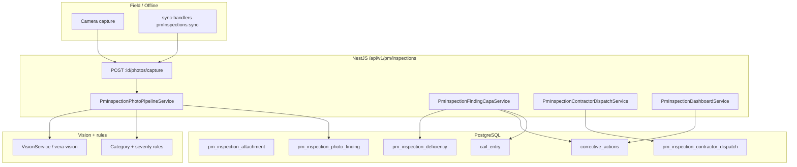
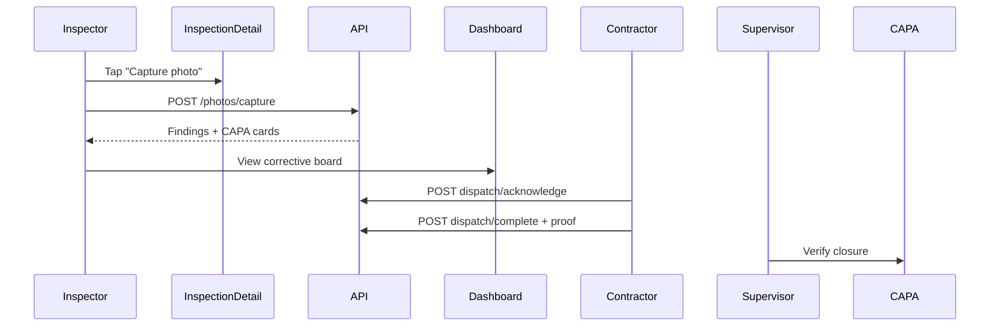

# Vera Platform — Upgraded Inspection Module (v2)

Production architecture for instant photo capture, AI-assisted hazard detection, automatic corrective actions, contractor dispatch, and real-time compliance dashboards. Built on the existing **PM inspection + unified CAPA** stack.

---

## 1. Backend architecture



| Service | Responsibility |
|---------|----------------|
| `PmInspectionPhotoPipelineService` | Upload attachment → OCR/vision → structured findings |
| `PmInspectionFindingCapaService` | Deficiency + CAPA with due date, evidence, assignee |
| `PmInspectionContractorDispatchService` | Package dispatch, ack, complete, overdue cron |
| `PmInspectionDashboardService` | Corrective board, alerts, contractor score |
| `PmCapaAutoGenerateService` | Existing checklist-failure CAPA (unchanged) |

---

## 2. Database schema

### Extended: `pm_inspection_attachment`

| Column | Type | Notes |
|--------|------|-------|
| `analysis_status` | text | `processing` \| `complete` \| `failed` |
| `analysis_json` | jsonb | Raw vision output |

### New: `pm_inspection_photo_finding`

| Column | Type |
|--------|------|
| `id` | uuid PK |
| `inspection_id` | FK → pm_inspection |
| `attachment_id` | FK → attachment (optional) |
| `category` | enum: unsafe_condition, missing_ppe, equipment_defect, housekeeping, environmental, other |
| `title`, `description` | text |
| `severity` | PmDeficiencySeverity |
| `confidence` | float |
| `responsible_party` | contractor \| supervisor \| company \| worker |
| `evidence_required` | jsonb string[] |
| `deficiency_id`, `corrective_action_id` | FKs |
| `client_sync_id` | unique (offline idempotency) |

### New: `pm_inspection_contractor_dispatch`

| Column | Type |
|--------|------|
| `corrective_action_id` | FK |
| `subcontractor_company_id` | FK → Company |
| `status` | pending → sent → acknowledged → completed \| overdue |
| `package_json` | photos, description, deadline, evidence |
| `notification_ids` | jsonb |

Migration: `backend/prisma/migrations/20260528120000_inspection_v2_photo_pipeline/`

---

## 3. API routes

Base: `/api/v1/pm/inspections`

| Method | Path | Description |
|--------|------|-------------|
| POST | `/:id/photos/capture` | Instant pipeline (upload + analyze + CAPA + optional dispatch) |
| GET | `/:id/photo-findings` | Structured findings for inspection |
| GET | `/dashboard/project/:projectId/corrective-board` | Kanban-style columns |
| GET | `/dashboard/project/:projectId/overdue-alerts` | Overdue CAPA + dispatches |
| GET | `/dashboard/project/:projectId/contractor-performance` | Score per subcontractor |
| POST | `/corrective-actions/:actionId/dispatch-contractor` | Manual contractor package send |
| POST | `/contractor-dispatch/:dispatchId/acknowledge` | Contractor ack |
| POST | `/contractor-dispatch/:dispatchId/complete` | Proof of completion |
| POST | `/sync` | Extended: `photoCaptures[]` processed after inspection sync |

**Photo capture body:**

```json
{
  "dataUrl": "data:image/jpeg;base64,...",
  "caption": "North scaffold — missing guardrail",
  "clientSyncId": "offline-photo-001",
  "offline": true,
  "defaultSubcontractorCompanyId": 42
}
```

**Response:**

```json
{
  "attachment": { "id": "...", "analysisStatus": "complete" },
  "findings": [{ "category": "unsafe_condition", "title": "..." }],
  "correctiveActions": [{ "id": "...", "dueAt": "..." }],
  "dispatches": [{ "dispatch": { "status": "sent" } }]
}
```

Zod: `packages/vera-api-contract/src/schemas/pm-inspection-v2.ts`

---

## 4. Automatic corrective action generation

For each photo finding:

| Field | Source |
|-------|--------|
| Title | Rule-based from category |
| Description | Vision summary / caption |
| Severity | low / medium / high / critical |
| Due date | `CapaDueDateEngine` + `PmCapaCompanyConfig` |
| Responsible party | Rule map (PPE→worker, equipment→contractor, etc.) |
| Evidence | Category matrix (`photo_after`, `supervisor_signoff`, …) |

Creates:

1. `PmInspectionDeficiency`
2. `PmCorrectiveAction` + `CailEntry` (sourceModule: `inspection`)
3. Links finding → deficiency → CAPA

---

## 5. Contractor dispatch workflow

When `responsibleParty = contractor` and `subcontractorCompanyId` set:

1. Build `packageJson` (photos, CAPA text, due date, evidence list)
2. Create/update `PmInspectionContractorDispatch` → `sent`
3. Notify company admins/supervisors via `NotificationsService`
4. Contractor acknowledges → `acknowledged`
5. Contractor uploads proof → `verification_pending` on CAPA
6. Hourly cron marks overdue → notifications

---

## 6. Dashboard enhancements

| Widget | Endpoint |
|--------|----------|
| Real-time corrective board | `corrective-board` (open / in progress / verification / overdue) |
| Overdue alerts | `overdue-alerts` |
| Contractor performance | `contractor-performance` (score, on-time %, completion rate) |

---

## 7. Event-driven logic

| Event | Emitter | Consumers |
|-------|---------|-----------|
| `inspection.completed` | Photo pipeline after analysis | Compliance handler, notification handler, vision stub |
| Audit `photo.capture.analyzed` | Photo pipeline | Inspection audit log |
| CAPA audit `contractor.acknowledged` / `contractor.completed` | Dispatch service | CAPA audit trail |
| Cron hourly | `PmInspectionV2Scheduler` | Overdue dispatch marking |

---

## 8. Notification templates

`backend/src/pm-inspections/inspection-notification.templates.ts`

| Template key | Trigger |
|--------------|---------|
| `inspection.finding.created` | New photo finding |
| `inspection.capa.assigned` | CAPA published |
| `inspection.contractor.dispatch` | Package sent |
| `inspection.contractor.overdue` | Past due dispatch |
| `inspection.capa.overdue` | Past due CAPA |

---

## 9. Offline compatibility

- `clientSyncId` on attachments, findings, dispatches (idempotent)
- `POST /pm/inspections/sync` accepts `photoCaptures[]` — processed after inspection upsert with `offline: true` on vision
- Field queue: extend `pmInspections.sync` payload with `photoCaptures` (frontend)

---

## 10. Frontend UI/UX flows



| Component | Path |
|-----------|------|
| `InspectionPhotoCapture` | In-inspection camera + pipeline status |
| `InspectionCorrectiveBoard` | Project dashboard kanban |
| `ContractorDispatchPanel` | Dispatch status + ack/complete |
| `InspectionOverdueAlerts` | Alert strip on PM inspections hub |

Routes: `/pm/inspections`, `/pm/inspections/[id]`, `/pm/inspections/dashboard?projectId=`

---

## 11. Vera Core integration

| System | Integration |
|--------|-------------|
| **CAIL** | CAPA emitter creates `CailEntry` per finding |
| **Training / compliance** | Overdue CAPA feeds compliance recalc via domain events |
| **SIF/HECA** | High/critical deficiencies still route via `PmInspectionsIngestionService` |
| **Equipment lockout** | Critical equipment defects trigger existing lockout path |
| **PM offline mode** | Compatible via sync batch + clientSyncId |

---

## Phase 2 polish (implemented)

| Feature | Implementation |
|---------|----------------|
| **LLM hazard detection** | `LlmSafetyService.analyzeInspectionPhotoFindings` — multi-finding JSON; merged with vision/rules in pipeline |
| **Subcontractor resolution** | `PmInspectionSubcontractorResolverService` — `PmProjectSafetyProfile` then `PmProjectConfig` `subcontractorIds`; category-based pick |
| **Offline photo sync** | `pmInspectionPhoto.capture` queue action + `photoCaptures[]` on `pmInspections.sync`; `blob-sync.ts` hydrates blobs to dataUrl |

**LLM env:** `VERA_LLM_ENDPOINT`, `OPENAI_API_KEY` or `VERA_LLM_API_KEY`, optional `VERA_LLM_MODEL`

**Subcontractors API:** `GET /api/v1/pm/inspections/projects/:projectId/subcontractors`

---

## File index

| Area | Path |
|------|------|
| Migration | `backend/prisma/migrations/20260528120000_inspection_v2_photo_pipeline/` |
| Services | `backend/src/pm-inspections/pm-inspection-*.service.ts` |
| Templates | `backend/src/pm-inspections/inspection-notification.templates.ts` |
| Scheduler | `backend/src/pm-inspections/pm-inspection-v2.scheduler.ts` |
| Contract | `packages/vera-api-contract/src/schemas/pm-inspection-v2.ts` |
| Frontend | `vera-frontend/components/inspection/Inspection*.tsx` |
| API client | `vera-frontend/lib/pm-inspection-v2.ts` |
