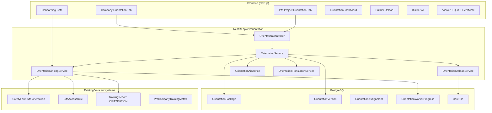
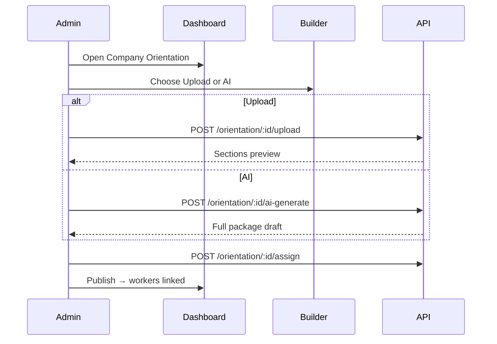
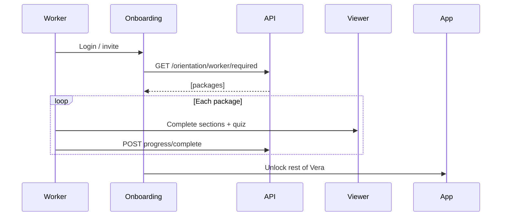

# Vera Core — Unified Orientation Module

Production architecture for company-level (VeraCompanies) and project-level (VeraPM) orientation packages with upload + AI pathways, worker linking, multi-language content, and versioning.

**Related:** [orientation-frontend-architecture.md](./orientation-frontend-architecture.md) · [orientation-ui-ux.md](./orientation-ui-ux.md) · [orientation-ai-behavior.md](./orientation-ai-behavior.md)

---

## 1. Full architecture



| Layer | Responsibility |
|-------|----------------|
| **OrientationPackage** | Logical package (company or project scoped), current version pointer |
| **OrientationVersion** | Immutable content snapshot (sections, media, quiz per language) |
| **OrientationAssignment** | Who must complete (company roster, project roster, onboarding) |
| **OrientationWorkerProgress** | Per-worker state, quiz, certificate, language |
| **OrientationLinkingService** | Auto-assign on company link / project assignment / onboarding |
| **Site access integration** | `requiresOrientation` checks latest completed version |

---

## 2. UI component tree

```
components/orientation/
├── OrientationDashboard.tsx          # List packages, metrics, CTA
├── OrientationBuilderShell.tsx       # Upload | AI tabs
├── OrientationBuilderUpload.tsx      # File drop, OCR progress, section preview
├── OrientationBuilderAI.tsx          # Copilot wizard (industry, hazards, region…)
├── OrientationViewer.tsx             # Section renderer + media
├── OrientationLanguageSwitcher.tsx   # en | fr | es | tl | pa
├── OrientationQuiz.tsx               # Question bank + scoring
├── OrientationCertificate.tsx        # PDF / print view
├── OrientationVersionHistory.tsx     # Timeline + rollback
├── OrientationWorkerList.tsx         # Progress table
├── OrientationSectionRenderer.tsx    # Block types: text, list, media, callout
└── hooks/
    ├── useOrientationPackage.ts
    └── useOrientationProgress.ts

app/companies/[id]/orientation/
├── page.tsx                          # Dashboard (company scope)
├── new/page.tsx                        # Builder
├── [packageId]/page.tsx                # View / edit
├── [packageId]/versions/page.tsx
└── [packageId]/workers/page.tsx

app/pm/orientation/
├── page.tsx                          # Dashboard (projectId query)
├── new/page.tsx
└── [packageId]/...

app/onboarding/orientation/[packageId]/page.tsx   # Worker-first gate
```

All shells use `WorkspaceHero`, `WorkspaceSection`, `SurfaceCardGrid`, `WorkspaceMetricCard` from `components/theme/workspace`.

---

## 3. REST API contract

Base: `/api/v1/orientation` — JWT required unless noted.

| Method | Path | Description |
|--------|------|-------------|
| POST | `/` | Create package (`companyId` xor `projectId`, `type`) |
| GET | `/:id` | Package + current version |
| PUT | `/:id` | Update metadata (bumps version if content changes) |
| DELETE | `/:id` | Soft-archive package |
| POST | `/:id/upload` | Multipart upload → OCR → sections |
| POST | `/:id/ai-generate` | AI wizard body → sections + quiz |
| POST | `/:id/translate` | `{ languages: string[] }` → new language blocks |
| POST | `/:id/assign` | `{ scope, required }` → linking job |
| GET | `/:id/workers` | Worker progress list |
| GET | `/:id/versions` | Version history |
| POST | `/:id/version/rollback` | `{ versionNumber }` |
| GET | `/worker/:workerId/required` | Packages blocking onboarding |
| POST | `/:id/progress/start` | Worker starts |
| POST | `/:id/progress/complete` | `{ quizAnswers, languageCode }` |
| GET | `/companies/:companyId` | List company packages |
| GET | `/projects/:projectId` | List project packages |

DTOs exported from `@vera/api-contract` → `schemas/orientation.ts`.

---

## 4. Database schema

See migration `backend/prisma/migrations/20260527120000_orientation_module/migration.sql` and Prisma models:

- `OrientationPackage` — `orientation_id` (UUID), `company_id`, `project_id`, `type`, `languages`, `version`, audit fields
- `OrientationVersion` — `sections` JSONB (language → blocks), `media`, `quiz`, `version_number`
- `OrientationAssignment` — scope enum `COMPANY | PROJECT | ONBOARDING`
- `OrientationWorkerProgress` — tracking + `certificate_id`
- `OrientationMedia` — optional normalized file refs to `CoreFile`

**Constraint:** exactly one of `company_id` or `project_id` set on package (CHECK).

---

## 5. Worker linking logic

```typescript
// Pseudocode — OrientationLinkingService

onCompanyLinkCreated(workerId, companyId):
  for (pkg of packages where companyId and assignment.scope in [COMPANY, ONBOARDING]):
    upsertProgress(workerId, pkg.id, status=NOT_STARTED, version=pkg.version)

onProjectAssignmentCreated(workerId, projectId):
  companyId = project.companyId
  for (pkg of packages where projectId or (companyId and scope=COMPANY)):
    upsertProgress(...)

onPackagePublished(packageId):
  resolveAllEligibleWorkers(package) → bulk upsert NOT_STARTED or REORIENTATION_REQUIRED

onVersionPublished(packageId, newVersion):
  for (progress where progress.versionNumber < newVersion):
    progress.status = REORIENTATION_REQUIRED
```

**Onboarding gate:** `GET /orientation/worker/:id/required` returns incomplete packages; onboarding UI blocks until all `COMPLETED` at `package.version`.

**Site access:** After completion, sync `SafetyForm` submission stub or set `TrainingRecord` with code `SITE_ORIENTATION` / `ORIENTATION`.

---

## 6. Orientation builder logic

### Upload mode

1. Accept files → `CoreFile` + `OrientationMedia`
2. `OrientationUploadService`: MIME route → PDF/PPT/DOCX parser or vision OCR (`vera-vision`)
3. Auto-section: heading detection → `OrientationSection[]`
4. `OrientationAiService.summarizeSections()` (optional OpenAI)
5. `OrientationQuizService.generateFromSections()` (5–10 questions)
6. `OrientationTranslationService.translateAll(languages)`
7. Create `OrientationVersion` v1

### AI-generated mode

1. Collect wizard: industry, business type, environment, hazards[], PPE[], programs[], `regulatoryRegion`, optional policy file IDs
2. `OrientationAiService.generatePackage()` — structured JSON schema (sections per topic)
3. Build slide-deck structure in `media.deck`
4. Generate quiz + certificate template
5. Translate all configured languages
6. Publish version

---

## 7. Multi-language system

**Supported locales (v1):** `en`, `fr`, `es`, `tl`, `pa`

**Storage shape:**

```json
{
  "sections": {
    "en": [{ "id": "welcome", "type": "text", "title": "...", "body": "..." }],
    "fr": [ ... ]
  },
  "quiz": {
    "en": [{ "id": "q1", "prompt": "...", "choices": [], "answerIndex": 0 }]
  }
}
```

- Auto-translate on create via `OrientationTranslationService` (OpenAI or template fallback)
- Admin manual override: `PUT /orientation/:id` with `sections.fr[n].body`
- Worker locale: `User.preferredLocale` or worker profile → default viewer language
- Certificate rendered in `progress.languageCode`

---

## 8. Version control

- `OrientationPackage.version` = current published version number
- Content edits create new `OrientationVersion` row (immutable)
- Rollback: set `package.version = target` + invalidate incomplete progress
- Admin `OrientationVersionHistory` shows diff summary + author + timestamp

---

## 9. UX flow diagrams

### Admin — create (company)



### Worker — onboarding



---

## 10. Integration plan — VeraCompanies + VeraPM

| Surface | Route | Action |
|---------|-------|--------|
| **VeraCompanies** | `/companies/[id]/orientation` | Add tab; link from `CompanyHeaderCard` |
| **VeraCompanies project** | `/companies/[id]/projects/[projectId]/orientation` | Project-scoped dashboard |
| **VeraPM** | `/pm/orientation?projectId=` | Add to `PmModuleNav` |
| **PM Site access** | `/pm/site-access-control` | Show orientation completion % |
| **Onboarding** | `/onboarding/orientation` | First-step gate |
| **Training matrix** | `PmCompanyTrainingMatrix` | Keep codes `ORIENTATION`, `SITE_ORIENTATION` in sync |
| **Safety forms** | `site-orientation` | Optional mirror submission on complete |

**Rollout phases:**

1. **Phase A** — Schema + API + Dashboard + Viewer (read-only published)
2. **Phase B** — Upload pipeline + AI wizard + translate
3. **Phase C** — Linking hooks (company link, project assign) + onboarding gate
4. **Phase D** — Site access + training record sync + certificates

---

## 11. Access control logic

`OrientationAccessService` enforces orientation before operational access:

| Check | Rule |
|-------|------|
| **Project access** | `assertWorkerCanAccessProject(workerId, projectId)` — no pending/outdated company + project packages |
| **Task / crew assign** | `assertWorkerCanBeAssigned(workerId, projectId)` — called from `ProjectsService.assignWorker` before assignment |
| **Outdated** | `REORIENTATION_REQUIRED` when package version bumps after worker completed an older version |
| **Legacy PM** | `PmSiteAccessControlService` still reads `SafetyForm` `site-orientation`; Core integration mirrors completion when definition exists |

`GET /api/v1/orientation/worker/:workerId/access?companyId=&projectId=` returns `{ allowed, blockers[] }`.

---

## 12. Completion tracking (Vera Core)

On `POST /orientation/:id/progress/complete` (or `/me/:id/progress/complete`):

1. `OrientationWorkerProgress` → `COMPLETED`, stores `quizScore`, `certificateId`, `languageCode`, `versionNumber`.
2. `OrientationCoreIntegrationService.syncTrainingRecord` upserts `TrainingRecord` with type `ORIENTATION` or `SITE_ORIENTATION` (project-scoped).
3. Certificate number format: `ORI-{packageId}-v{version}`.
4. Optional `SafetyForm` submission for `site-orientation` when project package completes.

**Surfaces:**

| View | Endpoint / source |
|------|-------------------|
| Worker profile → Training | `TrainingRecord` rows |
| Company dashboard | `GET /orientation/companies/:id/compliance` |
| Project dashboard | `GET /orientation/projects/:id/compliance` |
| Package admin | `GET /orientation/:id/stats` + worker list |

**Worker onboarding:** `/onboarding/orientation` lists `GET /orientation/me/required` and blocks workspace until complete.

---

## File index (implementation)

| Area | Path |
|------|------|
| Prisma | `backend/prisma/schema.prisma` (Orientation* models) |
| Migration | `backend/prisma/migrations/20260527120000_orientation_module/` |
| Backend | `backend/src/modules/orientation/` |
| Core integration | `orientation-core-integration.service.ts` |
| Access control | `orientation-access.service.ts` |
| Contract | `packages/vera-api-contract/src/schemas/orientation.ts` |
| Frontend lib | `vera-frontend/lib/orientation/api.ts` |
| Components | `vera-frontend/components/orientation/` |
| Company UI | `vera-frontend/app/companies/[id]/orientation/` |
| PM UI | `vera-frontend/app/pm/orientation/` |
| Onboarding | `vera-frontend/app/onboarding/orientation/` |
| FE architecture | `docs/orientation-frontend-architecture.md` |
