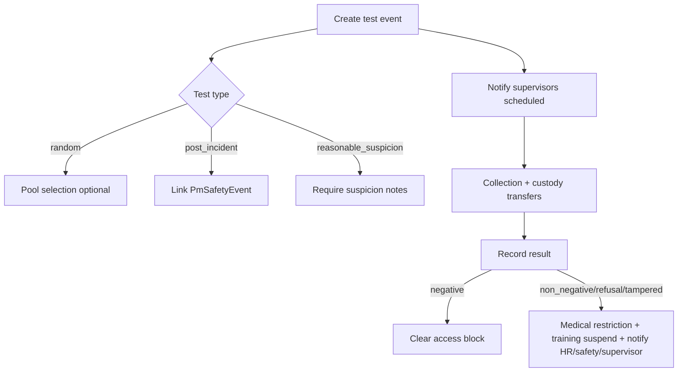

# Drug & Alcohol Testing Module — Architecture

*Vera Platform · May 2026*

---

## Overview

The Drug & Alcohol Testing module (`PmSubstanceTestingModule`) provides end-to-end substance testing workflows for construction and industrial safety programs, including DOT-style random pools, post-incident orders, reasonable suspicion documentation, digital chain of custody, result recording, and automated compliance actions integrated with worker profiles and incident investigations.

---

## 1. DB schema

### Enums

| Enum | Values |
|------|--------|
| `PmSubstanceTestType` | `random`, `post_incident`, `reasonable_suspicion`, `pre_employment`, `return_to_duty`, `follow_up` |
| `PmSubstanceTestStatus` | `scheduled` → `collection_scheduled` → `collected` → `in_transit` → `at_lab` → `pending_mro` → `completed` / `cancelled` |
| `PmSubstanceTestResultOutcome` | `negative`, `non_negative`, `refusal`, `tampered`, `cancelled`, `dilute` |
| `PmSubstanceSpecimenType` | `urine`, `oral_fluid`, `breath_alcohol` |
| `PmCustodyPartyRole` | `donor`, `collector`, `courier`, `lab_technician`, `mro`, `der`, `safety_officer`, `hr` |
| `PmSubstanceTestDocumentType` | `ccf`, `chain_of_custody`, `lab_report`, `mro_verification`, `der_notice`, `suspicion_form`, `other` |

### Tables

| Table | Purpose |
|-------|---------|
| `pm_substance_test_pool` | Company/project random selection pools |
| `pm_substance_test_pool_member` | Workers enrolled in a pool |
| `pm_substance_test_event` | Test order / event (links worker, incident, pool) |
| `pm_substance_test_result` | 1:1 result per event |
| `pm_substance_test_custody_transfer` | Timestamped custody handoffs |
| `pm_substance_test_signature` | Digital signatures (linked to transfers) |
| `pm_substance_test_attachment` | Secure document storage (CCF, lab reports) |

### Key relationships

- `PmSubstanceTestEvent.workerId` → `Worker`
- `PmSubstanceTestEvent.incidentEventId` → `PmSafetyEvent` (post-incident / investigation link)
- `PmSubstanceTestEvent.poolId` → `PmSubstanceTestPool` (random tests)

---

## 2. API routes

Base: `/api/v1/pm/substance-testing`

| Method | Path | Description |
|--------|------|-------------|
| `GET` | `/` | List tests (filters: companyId, projectId, workerId, status, testType) |
| `GET` | `/dashboard` | Pending count, non-negative count, recent tests |
| `POST` | `/` | Create test event (supervisor+) |
| `GET` | `/:id` | Full test detail |
| `PUT` | `/:id/status` | Update workflow status |
| `POST` | `/:id/result` | Record result + trigger compliance |
| `GET/POST` | `/:id/custody` | List / record custody transfer (signature required) |
| `GET/POST` | `/:id/attachments` | List / upload documents |
| `GET` | `/:id/signatures` | List all signatures |
| `GET` | `/workers/:workerId` | Worker test history |
| `GET` | `/incidents/:incidentId` | Tests linked to incident |
| `POST` | `/incidents/:incidentId/order` | Order post-incident test |
| `GET/POST` | `/pools` | List / create random pools |
| `POST` | `/pools/:poolId/random-select` | Random worker selection |
| `POST` | `/pools/:poolId/members` | Enroll worker in pool |

---

## 3. Chain of custody workflow

```
Donor (collection) → Collector signs transfer
    → Courier (in_transit) → Lab (at_lab) → MRO (pending_mro) → Result recorded (completed)
```

Each transfer requires:
- `fromRole`, `toRole`, party names, location
- **Digital signature** (`signatureData` as PNG data URL)
- Auto-incremented `sequenceNumber`
- Status auto-advance on `PmSubstanceTestEvent`

Notifications sent to supervisors on each custody transfer (`substance.test.custody`).

---

## 4. Result recording & compliance

### Outcomes

| Outcome | Compliance actions |
|---------|-------------------|
| `negative` | Clears `substance_testing` access requirement |
| `non_negative`, `refusal`, `tampered`, `dilute` | Medical restriction (blocks high-risk, confined space, hot work, equipment); unsatisfied access requirement; training suspension (`DOT_DRUG_AWARENESS`, `SUBSTANCE_ABUSE_POLICY` if present); HR/safety/supervisor notifications |

### Notification types

- `substance.test.scheduled`
- `substance.test.result`
- `substance.test.non_negative`
- `substance.test.refusal`
- `substance.test.tampered`
- `substance.test.custody`
- `substance.test.post_incident`

Recipients: `COMPANY_ADMIN`, `ADMIN` (HR), `SUPERVISOR`, `PROJECT_MANAGER`, `SUPER_ADMIN` (safety).

---

## 5. Integrations

### Worker profile

- Test history: `GET /workers/:workerId`
- Compliance writes to `PmWorkerMedicalRestriction`, `PmWorkerAccessRequirement`, `PmWorkerSafetyTraining`
- UI link from test detail → `/pm/worker-safety-profile?workerId=`

### Incident investigations

- `POST /incidents/:id/order` creates `post_incident` test
- Investigation `guidedAnswersJson.substance_test_id` updated on create
- Incident detail UI: `OrderTestFromIncident` component

### Training restrictions

- Non-negative outcomes set matching `PmWorkerSafetyTraining` rows to `status: suspended`
- Cleared on negative result via access requirement satisfaction

---

## 6. Frontend UI/UX

| Route | Component |
|-------|-----------|
| `/pm/substance-testing` | Dashboard — metrics, pool random select, filtered test list |
| `/pm/substance-testing/new` | Schedule test (type, specimen, suspicion notes) |
| `/pm/substance-testing/[id]` | Detail tabs: Overview, Chain of custody, Result, Documents |

### Components (`vera-frontend/components/substance-testing/`)

- `CreateTestForm` — test type + specimen + suspicion documentation
- `ChainOfCustodyPanel` — timeline + signature pad transfer form
- `SignaturePad` — canvas digital signature
- `ResultRecordingForm` — outcome selection + MRO notes + compliance trigger
- `TestDocumentsPanel` — secure CCF/lab report upload
- `OrderTestFromIncident` — incident investigation integration

---

## 7. Module wiring

`PmSubstanceTestingModule` imports `NotificationsModule`.

Registered in `app.module.ts` alongside other PM modules.

Migration: `20260530120000_substance_testing_module`

---

## 8. Compliance workflow diagram


