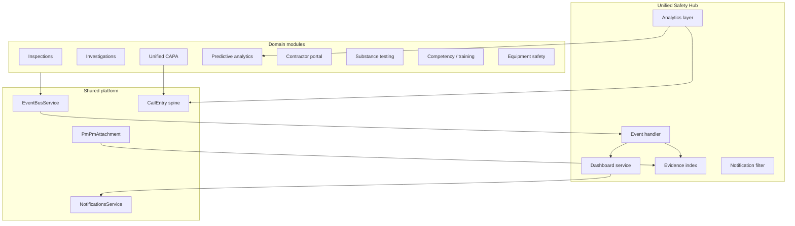

# Unified Safety Hub — Architecture

## Vision

The Unified Safety Hub is the **single operational surface** for Vera PM safety. It does not replace domain modules; it **federates** them behind five shared pillars:

| Pillar | Implementation |
|--------|----------------|
| One dashboard | `PmSafetyHubSnapshot` + `/api/v1/pm/safety-hub/dashboard` |
| One notification system | Filtered `NotificationsService` feed + domain events |
| One evidence library | `PmSafetyEvidenceIndex` + reindex from all attachment sources |
| One corrective action engine | Delegates to `PmUnifiedCorrectiveActionService` / `PmCorrectiveAction` |
| One analytics layer | Merges `PmPredictiveSafetyForecast` + `CailScore` / `CailRecommendation` / `CailCorrelation` |

**UI route:** `/pm/safety-hub`

---

## System context



---

## Database schema

### `PmSafetyHubSnapshot`

Cached aggregate JSON per `(companyId, projectId?)`. Refreshed on domain events or via `POST /dashboard/refresh`.

### `PmSafetyEvidenceIndex`

Denormalized search index for cross-module evidence:

| Field | Purpose |
|-------|---------|
| `domain` | `PmSafetyHubDomain` enum |
| `sourceType` / `sourceId` | Origin record (inspection, capa, incident, …) |
| `attachmentId` | Link to `PmPmAttachment` when applicable |
| `legacyRef` | Stable key for module-specific attachment rows |
| `tagsJson` | CAIL / user tags |

Sources reindexed: `PmPmAttachment`, CAPA attachments, inspection attachments, incident attachments, substance test attachments.

### `PmSafetyHubEventLog`

Append-only timeline of domain events for the hub UI and audit.

### Enum `PmSafetyHubDomain`

`inspection` · `investigation` · `corrective_action` · `predictive` · `contractor` · `substance_testing` · `competency` · `equipment`

---

## API (`/api/v1/pm/safety-hub`)

| Method | Path | Description |
|--------|------|-------------|
| GET | `/meta` | Domain labels, module links, five pillars |
| GET | `/dashboard` | Cached or live snapshot (all 8 domains) |
| POST | `/dashboard/refresh` | Force rebuild snapshot |
| GET | `/evidence` | Search unified evidence library |
| POST | `/evidence/reindex` | Rebuild evidence index (admin) |
| GET | `/notifications` | Safety-filtered in-app notifications |
| GET | `/notifications/unread-count` | Unread safety notification count |
| GET | `/analytics` | Predictive + CAIL intel unified layer |
| GET | `/capa` | Unified CAPA dashboard (delegate) |
| GET | `/timeline` | Hub event log |

---

## Event-driven logic

### Domain events (extended)

```typescript
SAFETY_HUB_INVALIDATE
SAFETY_EVIDENCE_INDEXED
INVESTIGATION_UPDATED
CAPA_CREATED
CAPA_STATUS_CHANGED
SUBSTANCE_TEST_COMPLETED
CONTRACTOR_DISPATCH_SENT
```

Plus existing: `CAIL_*`, `INSPECTION_COMPLETED`, `COMPLIANCE_RECALC`, …

### `PmSafetyHubEventHandler`

On module init, subscribes to `HUB_INVALIDATION_EVENTS`. For each event:

1. Append `PmSafetyHubEventLog`
2. On `SAFETY_EVIDENCE_INDEXED`, upsert `PmSafetyEvidenceIndex`
3. Rebuild `PmSafetyHubSnapshot` for `companyId` / `projectId`

### Module emitters (integration)

| Module | Event |
|--------|-------|
| Inspection contractor dispatch | `CONTRACTOR_DISPATCH_SENT` |
| CAIL / CAPA services | `CAIL_*`, `CAPA_*` (recommended) |
| Attachments media | `SAFETY_EVIDENCE_INDEXED` (recommended on upload) |
| Substance testing | `SUBSTANCE_TEST_COMPLETED` (recommended) |

---

## Permissions

Same PM roles as other safety modules: `WORKER`, `SUPERVISOR`, `ADMIN`, `COMPANY_ADMIN`, `PROJECT_MANAGER`, `CONTRACTOR_ADMIN`.

Evidence reindex and snapshot refresh: supervisor+ roles.

All queries scoped by `companyId` (+ optional `projectId`).

---

## UI/UX

### Layout (`/pm/safety-hub`)

1. **Hero** — five pillars + refresh
2. **Metric strip** — alert score, open CAPA, open CAIL, evidence count
3. **Tabs**
   - **Overview** — cross-module event timeline
   - **Domains** — 8 cards with deep links to module UIs
   - **CAPA queue** — top open actions from unified engine
   - **Evidence library** — search + thumbnails
   - **Analytics** — predictive + CAIL JSON (links to full intel UIs)
   - **Notifications** — unified safety notification center

### Navigation

First step in `PM_SAFETY_WORKFLOW` and first entry in `PM_MODULE_LINKS`.

---

## Relationship to existing hubs

| Surface | Role |
|---------|------|
| **Unified Safety Hub** (`/pm/safety-hub`) | Operational command center across 8 domains |
| Unified Safety Intelligence (`/pm/unified-safety-intelligence`) | CAIL ML scores, recommendations, explainability |
| VSI (`/pm/safety-intelligence`) | Legacy CAIL CRUD, VSI inspections/BBO |
| Contractor portal (`/contractor`) | Subcontractor-facing slice |
| Command Center | Enterprise realtime (separate) |

**Guidance:** New cross-module features should emit hub events, index evidence, and surface metrics on the Safety Hub dashboard.

---

## Migration

`20260533120000_unified_safety_hub` — creates enum + three tables.

```bash
cd backend && npx prisma migrate deploy && npx prisma generate
```

Initial evidence population:

```http
POST /api/v1/pm/safety-hub/evidence/reindex?companyId=1&projectId=1
```

---

## File map

| Area | Path |
|------|------|
| Backend module | `backend/src/pm-safety-hub/` |
| Prisma models | `schema.prisma` (Unified Safety Hub section) |
| Frontend client | `vera-frontend/lib/pm-safety-hub.ts` |
| Frontend UI | `vera-frontend/src/pages/pm/safety-hub/dashboard.tsx` |
| Route | `vera-frontend/app/pm/safety-hub/page.tsx` |
