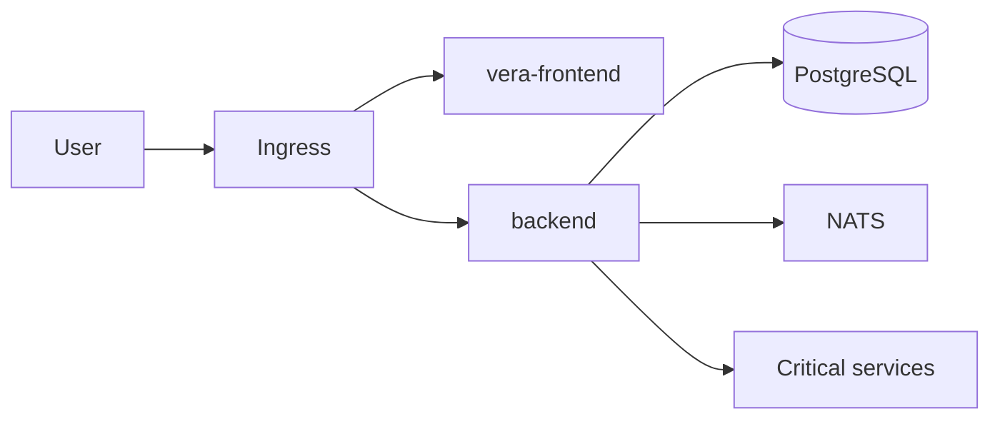

# Vera Core Deployment Guide

This guide defines production deployment tiers, release artifacts, promotion flow, and rollback procedures for Vera Hub/Core/PM/FieldOS.

## Deployment topology

- Frontend: `vera-frontend` container behind HTTPS ingress
- Backend: `backend` container exposing `/health` and `/ready`
- Data plane: PostgreSQL 16 + NATS
- Optional sidecars: API gateway and critical services under `services/`



## Environment tiers

### Dev
- Source of truth: `docker-compose.vera-core.yml`
- Fast feedback with seeded data and local ports

### Stage
- Deployed from tagged release image
- Same env contract as prod with stage values
- Automatic post-deploy smoke checks required

### Prod
- Promotion-only deploy from validated stage image tag
- Manual approval gate + rollback runbook signoff
- Strict env validation (`VERA_VALIDATE_ENV_STRICT=1`)

## Release artifacts and promotion

1. Create a tag `vX.Y.Z`.
2. `release-images.yml` publishes:
   - `ghcr.io/<org>/<repo>/vera-backend:vX.Y.Z`
   - `ghcr.io/<org>/<repo>/vera-frontend:vX.Y.Z`
3. Deploy the exact same tag to stage.
4. Run required checks:
   - `/health` and `/ready`
   - authenticated E2E smoke
   - map/sync smoke
5. Promote unchanged images from stage to prod.

## Environment contract

- Local template: `.env.example`
- Production template: `.env.production.example`
- Required production values:
  - `DATABASE_URL`
  - `JWT_SECRET`
  - `CORS_ORIGIN`
  - `PUBLIC_API_URL`
  - `PUBLIC_BASE_URL`
  - `ENABLE_ORIGIN_GUARD=1`
  - `VERA_VALIDATE_ENV_STRICT=1`

## Deploy runbook

1. Confirm all required CI checks are green.
2. Export env vars from secret manager.
3. Run DB backup and migration:
   ```bash
   MIGRATE_BACKUP_ON_DEPLOY=1 node scripts/migrate.mjs
   ```
4. Pull release images by tag.
5. Restart services with zero-downtime strategy.
6. Verify:
   - `GET /health`
   - `GET /ready`
   - authenticated API call
7. Run smoke suite for Hub/Core/PM/FieldOS routes.

## Rollback runbook

### Application rollback
1. Select prior stable release tag.
2. Redeploy backend/frontend images to previous tag.
3. Verify `/health`, `/ready`, and auth flows.

### Database rollback (last resort)
1. Stop write traffic.
2. Restore pre-migrate backup generated by `pre-migrate-backup.mjs`.
3. Redeploy matching application tag for the restored schema.
4. Re-run smoke and data-integrity checks.

## Local quick start

```bash
docker compose -f docker-compose.vera-core.yml up --build
```

- Frontend: `http://localhost:3001`
- Backend: `http://localhost:3000`
- Health: `http://localhost:3000/health`
- Ready: `http://localhost:3000/ready`

## Related docs

- [Vera Core Database](./vera-core-database.md)
- [Vera Event Bus](./vera-event-bus-integration.md)
- [Worker Wallet & Provider Sync](./worker-wallet-provider-sync-integration.md)
- [Security Model](./security.md)
- [VeriSuite SMS Production Deploy](./verisuite-sms-production-deploy.md)
