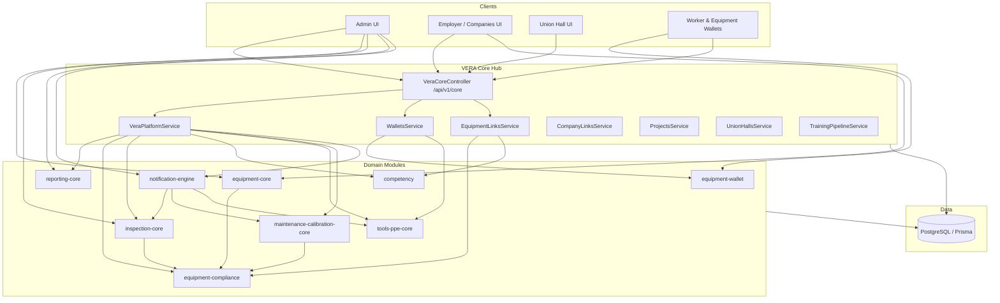

# VERA Core — Full System Integration

This document describes how all domain modules are integrated under **VERA Core** (`/api/v1/core`) and the satellite `*-core` APIs.

## Architecture map



## Module registry

| Module | API prefix | Registered | Core integration |
|--------|------------|------------|------------------|
| Equipment | `/api/v1/equipment` | Yes | Links via `equipment-links`, scan via `equipment-links/scan` |
| Competency | `/api/v1/competency` | Yes | Facade: `POST core/competency/evaluate` |
| Inspections | `/api/v1/inspections` | Yes | Facade: `POST core/inspections`; triggers compliance |
| Compliance engine | `/api/v1/equipment-compliance` | Yes | Central `recalculate()`; used by all safety modules |
| Tools & PPE | `/api/v1/tools-ppe` | Yes | Worker wallet via `WalletsService` |
| Maintenance & calibration | `/api/v1/maintenance-calibration` | Yes | Equipment wallet tab; notifications |
| Reporting | `/api/v1/reporting` | Yes | Platform summary via `GET core/platform/summary` |
| Notifications | `/api/v1/notifications` | Yes | Scheduler: `POST core/platform/notify-due` |
| Analytics (legacy) | `/analytics` | **Yes** (registered) | Workspace dashboard metrics |
| Training ingestion | `/api/v1/training-ingestion` | Yes | Wallet sync on bulk ingest rows |

## Canonical API flows

### QR scan (equipment)

1. **Link + summary:** `POST /api/v1/core/equipment-links/scan`  
   Body: `{ qrToken, companyId }`  
   Returns: link, compliance, `walletUrl`, wallet summary.

2. **Alias (equipment module):** `POST /api/v1/equipment/scan` — same link service.

3. **Public verify:** `GET /qr/equipment/:id` (QrModule) — read-only kiosk.

### Wallets

| Asset | Summary | Full |
|-------|---------|------|
| Worker | `GET /api/v1/core/wallets/worker/:id` | Verify UI may use `/verify/worker/:id/full` |
| Equipment | `GET /api/v1/core/wallets/equipment/:id` | `GET /api/v1/core/wallets/equipment/:id/full` or `/api/v1/equipment/:id/wallet` |

Full equipment wallet includes: inspections, competency, maintenance/calibration, compliance, QR.

### Training ingestion

| Path | Purpose |
|------|---------|
| `POST /api/v1/training-ingestion/upload` | Bulk file ingest |
| `POST /api/v1/core/training/ingest` | Single record + company link + wallet item |
| CSV `/training-ingestion/csv` | Legacy bulk |

Bulk rows now call `syncWorkerWalletItem()` after each record (aligned with training pipeline).

### Platform hub

| Endpoint | Purpose |
|----------|---------|
| `GET /api/v1/core/platform/summary?companyId=` | Aggregates reporting, equipment, inspections, competency, tools/PPE, M&C |
| `POST /api/v1/core/platform/notify-due?companyId=` | Runs full notification scheduler |

### Notifications scheduler

| Schedule | Tasks |
|----------|--------|
| Daily 6:00 | Inspections due, competency expiry, PPE expiry, maintenance |
| Hourly | Worker assignment start/end, project/equipment assignments |

Manual: `POST /api/v1/notifications/scheduler/run` or platform notify-due.

## Frontend routes

| Area | Routes |
|------|--------|
| Admin hub | `/admin`, `/admin/reporting`, `/admin/notifications` |
| Equipment | `/admin/equipment`, `/admin/equipment/compliance`, `/equipment/[id]/wallet` |
| Inspections | `/admin/inspections` |
| Tools & PPE | `/admin/tools-ppe` |
| Maintenance | `/admin/maintenance-calibration` |
| Projects | `/admin/projects`, `/admin/reporting/projects` |
| Union hall | `/union-hall`, `/union-hall/[id]` |
| Employer | `/companies`, `/companies/[id]`, `/admin/companies/[id]/roster|fleet` |
| Settings | `/admin/settings/notifications` |

## API contract package

Schemas exported from `@vera/api-contract`:

- `inspection`, `competency`, `equipment`, `equipment-compliance`, `equipment-wallet`
- `tools-ppe`, `maintenance-calibration`, `reporting`, `notifications`, `vera-core`

## Integration checklist (ops)

```bash
cd backend
npm install --legacy-peer-deps
npx prisma migrate deploy
npm run start:dev
```

```bash
cd vera-frontend
npm run dev
```

### Smoke tests

1. `GET /api/v1/core/platform/summary` (supervisor JWT)
2. `GET /api/v1/equipment/:id/wallet` (staff JWT)
3. `POST /api/v1/core/equipment-links/scan` with valid `qrToken`
4. `GET /api/v1/notifications` (inbox)
5. `POST /api/v1/notifications/scheduler/run` (admin)
6. Admin UI: `/admin/reporting`, `/admin/notifications`, `/admin/projects`

## Deprecated / avoid

| Path | Use instead |
|------|-------------|
| `/notifications` (unguarded legacy) | Removed from module; use `/api/v1/notifications` |
| `/compliance/company/:id` | `/companies/:id/compliance` |
| `/workers/search` | `/api/v1/core/workers/search` |
| `/reporting/*` (legacy module) | `/api/v1/reporting` |

## Files changed in integration pass

### Backend (new)

- `src/modules/vera-core/vera-platform.service.ts`
- `src/modules/vera-core/dto/link-equipment-qr.dto.ts`
- `prisma/migrations/20260517030000_notification_engine/`

### Backend (updated)

- `src/modules/vera-core/vera-core.module.ts` — imports wallet, reporting, M&C, notifications
- `src/modules/vera-core/vera-core.controller.ts` — platform summary, wallet full, enhanced QR scan
- `src/modules/vera-core/wallets.service.ts` — delegates full equipment wallet
- `src/training-ingestion/training-ingestion.service.ts` — wallet sync on ingest
- `src/app.module.ts` — `AnalyticsModule`
- `src/notifications/notifications.module.ts` — service-only export (no duplicate controller)

### Frontend (new)

- `lib/api/vera-platform.ts`
- `app/admin/projects/page.tsx`

### Frontend (updated)

- `lib/api/companies.ts` — correct compliance path
- `components/dashboard/MetricsGrid.tsx`, `RecentActivityCard.tsx` — training links
- `components/dashboard/dashboard-api.ts` — platform fallback
- `app/supervisor/worker-lookup/page.tsx` — core search
- `src/components/layout/shell-nav.ts` — projects nav
- `src/components/layout/VeraAppShell.tsx` — notification bell
