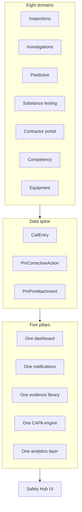

# Vera Safety Ecosystem — Unified Architecture

**Version:** 1.0.0  
**Hub route:** `/pm/safety-hub`  
**Integration API:** `/api/v1/pm/safety-ecosystem/status`  
**Event bus:** In-process `EventBusService` (monolith); NATS package available for microservices

---

## Executive summary

The Vera Safety Ecosystem unifies eight safety domains behind five platform pillars. Domain modules retain specialized UIs and APIs; the **Safety Hub** and **Safety Ecosystem Events** layer provide cross-cutting dashboard, evidence, notifications, CAPA orchestration, and analytics.



---

## 1. Inspection system — Photo → findings → CAPA → contractor dispatch

### Flow

```
Photo capture → Vision + LLM analysis → Structured findings
  → Auto CAPA (severity, due date, responsible party)
  → Contractor dispatch (if subcontractor)
  → Hub event + evidence index
```

### Key implementation

| Layer | Path |
|-------|------|
| Photo pipeline | `backend/src/pm-inspections/pm-inspection-photo-pipeline.service.ts` |
| Finding → CAPA | `pm-inspection-finding-capa.service.ts` |
| Contractor dispatch | `pm-inspection-contractor-dispatch.service.ts` |
| Dashboard | `pm-inspection-dashboard.service.ts` |
| API | `GET/POST /api/v1/pm/inspections/*` |
| UI | `/pm/inspections`, `/pm/inspections/dashboard` |

### DB (core)

- `PmInspection`, `PmInspectionDeficiency`, `PmInspectionPhotoFinding`
- `PmInspectionAttachment`, `PmInspectionContractorDispatch`
- `PmCorrectiveAction` (via `subcontractorCompanyId`)

### Events emitted

- `inspection.completed`
- `contractor.dispatch_sent`
- `safety_hub.evidence_indexed` (via attachments)

### Offline

- `pmInspections.sync` (includes `photoCaptures[]` batch)
- `pmInspectionPhoto.capture` (standalone queue → server batch router)

---

## 2. Investigation system — TapRooT-style RCA

### Capabilities

- TapRooT causal pathways (`rca.engine.ts`)
- Guided investigation flow + causal tree
- CAPA auto-generation (`pm-investigation-capa-integration.service.ts`)
- Evidence: attachments on `PmSafetyEvent`
- PDF report (`pm-investigation-report.service.ts`)

### API

`/api/v1/pm/incidents/*` — investigation routes on event controller

### UI

`/pm/incidents/[id]` — tabs: investigation, RCA, evidence, report

### Events (integrated)

- `investigation.updated` on investigation save

---

## 3. Drug & alcohol testing

### Capabilities

- Test types: random, post-incident, suspicion, pre-employment, RTD, follow-up
- Chain of custody + digital signatures
- Results: negative, non-negative, refusal, tampered, dilute
- Compliance: notifications, training restrictions (`pm-substance-testing-compliance.service.ts`)
- Incident ordering: `POST .../incidents/:id/order`

### API

`/api/v1/pm/substance-testing`

### UI

`/pm/substance-testing`

### Events (integrated)

- `substance_test.completed` on `recordResult`

---

## 4. Predictive safety analytics

### Capabilities

- 90-day feature extraction (inspections, incidents, CAPA, training, equipment, access)
- Risk scoring: workers, contractors, tasks, locations
- Weekly forecast + alerts
- ML pipeline → `CailScore`, `CailPrediction`, `CailRecommendation`

### API

`/api/v1/pm/predictive-safety-analytics`

### Scheduler

- Weekly Mon 06:00 + nightly refresh
- Emits `safety_hub.invalidate` after weekly run

### UI

`/pm/predictive-safety-analytics`

---

## 5. Contractor safety portal

### Capabilities

- Corrective action inbox (dispatch-backed)
- Inspection findings + hazard acknowledgment
- Compliance: training, credentials, equipment audit
- Messaging + notifications

### API

`/api/v1/pm/contractor-portal`

### Roles

`CONTRACTOR_ADMIN`, `CONTRACTOR_USER` — scoped to `user.companyId`

### UI

`/contractor`

### Events (integrated)

- Consumes `contractor.dispatch_sent`
- Emits hub invalidate on ack/complete + `capa.status_changed`

---

## 6. Unified Safety Hub

### Five pillars

| Pillar | Table / service |
|--------|-----------------|
| Dashboard | `PmSafetyHubSnapshot`, `PmSafetyHubDashboardService` |
| Notifications | `PmSafetyHubNotificationsService` → `NotificationsService` |
| Evidence | `PmSafetyEvidenceIndex`, `PmSafetyHubEvidenceService` |
| CAPA | Delegates `PmUnifiedCorrectiveActionService` |
| Analytics | `PmSafetyHubAnalyticsService` + predictive forecast |

### API

`/api/v1/pm/safety-hub`

### Event handler

`PmSafetyHubEventHandler` — listens to 14+ domain events, rebuilds snapshot, indexes evidence

---

## 7. Unified corrective action engine

### Spine

`CailEntry` (1:1) ↔ `PmCorrectiveAction`

### API

- Primary: `/api/v1/pm/unified-corrective-action`
- Legacy: `/api/v1/pm/corrective-actions`

### Cross-module generation

Inspection findings, investigations, hazards, equipment, meetings → `createFromSource`

### Events (integrated)

- `capa.created`, `capa.status_changed`

---

## 8. Safety ecosystem integration layer

### `SafetyEcosystemEventsService` (global)

`backend/src/pm-safety-ecosystem/`

Central emitter used by all domains to publish hub-invalidating events without circular module imports.

### Status endpoint

`GET /api/v1/pm/safety-ecosystem/status` — module registry, API prefixes, offline sync types

---

## Unified database schema (safety tables)

| Domain | Primary tables |
|--------|----------------|
| Inspections | `pm_inspection*`, `pm_inspection_contractor_dispatch` |
| Investigations | `pm_safety_event*`, `pm_safety_event_investigation` |
| CAPA | `corrective_actions`, `corrective_action_*` |
| CAIL | `cail_entry`, `cail_*` intel tables |
| Predictive | `pm_predictive_safety_forecast` |
| Contractor | `pm_contractor_portal_*`, `pm_contractor_finding_acknowledgment` |
| Substance | `pm_substance_test_*` |
| Hub | `pm_safety_hub_snapshot`, `pm_safety_evidence_index`, `pm_safety_hub_event_log` |
| Evidence platform | `pm_attachments` |

Full Prisma definitions: `backend/prisma/schema.prisma`

---

## API route map

| Module | Base path |
|--------|-----------|
| Inspections | `/api/v1/pm/inspections` |
| Incidents / investigations | `/api/v1/pm/incidents` |
| Unified CAPA | `/api/v1/pm/unified-corrective-action` |
| Substance testing | `/api/v1/pm/substance-testing` |
| Predictive analytics | `/api/v1/pm/predictive-safety-analytics` |
| Contractor portal | `/api/v1/pm/contractor-portal` |
| Safety hub | `/api/v1/pm/safety-hub` |
| Safety ecosystem | `/api/v1/pm/safety-ecosystem` |
| Unified intelligence | `/api/v1/pm/unified-safety-intelligence` |
| Attachments | `/api/v1/pm/attachments-media` |
| Notifications | `/api/v1/notifications` |

---

## Event-driven logic

### Domain events (`domain-events.ts`)

```
inspection.completed
cail.created | assigned | resolved | verified | overdue
investigation.updated
capa.created | capa.status_changed
substance_test.completed
contractor.dispatch_sent
safety_hub.invalidate
safety_hub.evidence_indexed
compliance.recalc
```

### Processing pipeline

```
Module action → SafetyEcosystemEventsService.emit()
  → EventBusService (in-process)
    → PmSafetyHubEventHandler
      → PmSafetyHubEventLog (timeline)
      → PmSafetyEvidenceIndex (if evidence event)
      → PmSafetyHubSnapshot rebuild
```

### Queues

- **Field sync queue** (client IndexedDB): `vera-frontend/lib/field/sync-queue.ts`
- **Offline batch router** (server): `backend/src/pm-offline-mode/offline-batch.router.ts`
- **Cron schedulers**: predictive weekly, inspection overdue dispatches, hub snapshot refresh on events

---

## Notification routing

| Source | Channel | Service |
|--------|---------|---------|
| All PM safety | In-app | `NotificationsService` |
| Hub filter | Safety types only | `PmSafetyHubNotificationsService` |
| CAPA overdue | CAIL templates | `cail-overdue.scheduler.ts` |
| Substance non-negative | Compliance service | `pm-substance-testing-compliance.service.ts` |
| Contractor dispatch | Inspection templates | `inspection-notification.templates.ts` |

Prefixes: `cail`, `inspection`, `contractor`, `substance`, `capa`, `predictive`, `safety_hub`

---

## Permissions model

| Role | Hub | Inspections | Incidents | CAPA | Contractor portal |
|------|-----|-------------|-----------|------|-------------------|
| WORKER | Read | Execute | Report | Assigned | — |
| SUPERVISOR | Full PM | Full | Investigate | Manage | — |
| COMPANY_ADMIN | Full | Full | Full | Full | Create membership |
| CONTRACTOR_ADMIN | Limited | — | — | Inbox only | Full portal |
| CONTRACTOR_USER | Limited | — | — | Inbox | Portal user |

Tenant isolation: `companyId` on all queries; contractor users restricted to `user.companyId === subcontractorCompanyId`.

---

## Offline mode compatibility

| Sync type | Client | Server batch |
|-----------|--------|--------------|
| `pmInspections.sync` | ✓ | ✓ |
| `pmInspectionPhoto.capture` | ✓ | ✓ (integrated) |
| `pmIncidents.sync` | ✓ | ✓ |
| `pmCapa.sync` | ✓ | ✓ |
| `pmUnifiedCorrectiveAction.sync` | ✓ | Direct API |
| `pmUnifiedSafetyIntelligence.sync` | ✓ | Direct API |

Blob storage: `vera-frontend/lib/field/blob-sync.ts`

---

## Frontend UI map

| Module | Route |
|--------|-------|
| **Safety Hub** | `/pm/safety-hub` |
| Inspections | `/pm/inspections` |
| Incidents | `/pm/incidents` |
| Unified CAPA | `/pm/unified-corrective-action` |
| Predictive | `/pm/predictive-safety-analytics` |
| Substance | `/pm/substance-testing` |
| Contractor | `/contractor` |
| CAIL intel | `/pm/unified-safety-intelligence` |

Navigation: `vera-frontend/lib/navigation/pm-workflow.ts`

---

## Integration with Vera Core

- **Workers / training:** `TrainingRecord`, `CompanyLink`, competency evaluations
- **Equipment:** `CompanyEquipmentAuditView`, `PmEquipmentCertification`
- **Projects / sites:** `Project`, `Site` on all PM entities
- **Files:** `CoreFile` + `PmPmAttachment` + `coreFileId` linkage
- **Auth:** JWT + `RolesGuard` on all PM controllers

---

## System-wide analytics & reporting

| Layer | Output |
|-------|--------|
| Safety Hub dashboard | Cross-domain KPIs + alert score |
| Predictive engine | Weekly forecast JSON + entity risk lists |
| CAIL intelligence | Scores, recommendations, correlations |
| Investigation report | PDF / executive summary |
| Inspection dashboard | Corrective board, contractor scoring |

---

## Migrations (apply in order)

1. `20260528120000_inspection_v2_photo_pipeline`
2. `20260529120000_investigation_module_v2`
3. `20260530120000_substance_testing_module`
4. `20260531120000_predictive_safety_analytics`
5. `20260532120000_contractor_safety_portal`
6. `20260533120000_unified_safety_hub`

```bash
cd backend && npx prisma migrate deploy && npx prisma generate
```

---

## Related documentation

- `docs/unified-safety-hub-architecture.md`
- `docs/contractor-safety-portal-architecture.md`
- `docs/predictive-safety-analytics-architecture.md`
- `docs/substance-testing-module-architecture.md`
- `docs/investigation-module-v2-architecture.md`
- `docs/vera-unified-safety-platform-architecture.md`

---

## Operational checklist

1. Provision contractor users + portal memberships
2. Run evidence reindex: `POST /api/v1/pm/safety-hub/evidence/reindex`
3. Run predictive pipeline once: `POST /api/v1/pm/predictive-safety-analytics/run`
4. Open `/pm/safety-hub` as primary safety landing
5. Use field offline sync for inspections and incidents on site

The ecosystem is designed so **every domain module emits events**, the **hub aggregates**, and **CAPA + CAIL** remain the single closure spine for all safety work.
