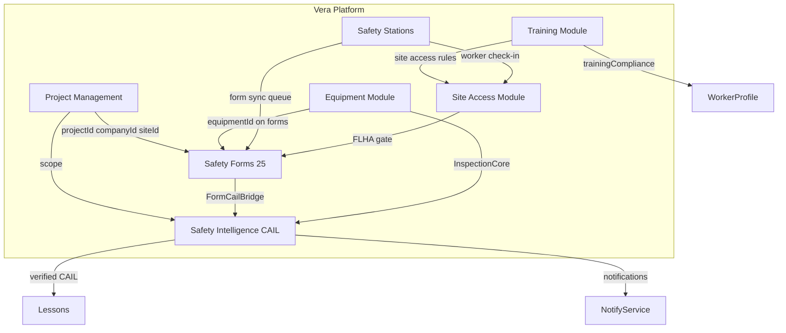

# Vera Safety Management Module — Complete Production Architecture

**Version:** 1.0 · **Date:** 2026-05-19  
**Status:** Canonical specification; **implementation matrix** marks each capability as `LIVE`, `PARTIAL`, or `PLANNED`.  
**Code roots:** `backend/src/safety-intelligence/`, `backend/src/forms/`, `backend/src/pm-safety-workflow/`, `vera-frontend/app/pm/`

---

## Implementation matrix (summary)

| # | Capability | Status | Primary surface |
|---|------------|--------|-----------------|
| 1 | Core Safety Engine + CAIL | **LIVE** | `safety-intelligence/` |
| 2 | JHA / FLHA | **PARTIAL** | Forms `daily-flha`, `pha` + legacy `PmSafetyWorkflow` |
| 3 | SIF / HECA Engine | **PARTIAL** | Form flags + CAIL `sourceType` sif/heca |
| 4 | Inspections & Checklists | **LIVE** | VSI inspections + form `general-inspection` |
| 5 | Incidents / Near miss / Observations | **LIVE** | VSI + forms + legacy `/incidents` |
| 6 | Corrective Action Management | **LIVE** | `CailEntry` lifecycle |
| 7 | Safety Meetings & Toolbox | **PARTIAL** | `ToolboxTalk`, `CoreMeetingRecord`, form `toolbox-talk` |
| 8 | SDS & Document Control | **LIVE** | `/pm/safety/sds` |
| 9 | Equipment Safety | **LIVE** | `inspection-core` + equipment bridge |
| 10 | Emergency Response | **LIVE** | Form + `/pm/safety/emergency` muster API |
| 11 | Site Access Control | **LIVE** | Form + `SiteAccessService` evaluator |
| 12 | Safety Stations | **LIVE** | Heartbeat API `/pm/safety/stations` |
| 13 | Safety Intelligence & Analytics | **LIVE** | Dashboards, predictive risk, copilot |
| 14 | Offline Mode | **LIVE** | Field sync v2 + `useSafetyForm` offline path |
| 15 | API Layer | **LIVE** | `/api/v1/pm/safety-*` |
| 16 | Database Schema | **LIVE** | Prisma models below + §16 extensions |
| 17 | Frontend Architecture | **LIVE** | `/pm/*` |

---

# DELIVERABLE 1 — Full backend architecture

## 1.1 Module topology (NestJS)

```
AppModule
├── SafetyIntelligenceModule          # CAIL hub, VSI sub-modules, AI, schedulers
│   ├── CailModule
│   ├── InspectionsModule (VSI)
│   ├── BboModule
│   ├── IncidentsVsiModule
│   ├── LessonsLearnedModule
│   ├── DashboardsModule
│   ├── EquipmentBridgeModule
│   ├── ProjectSafetyRoleModule
│   ├── AiCopilotModule
│   └── DomainEventBusModule (import only)
├── SafetyFormsModule                 # Unified 25-form engine
│   ├── DefinitionsModule
│   ├── FormEngineModule
│   ├── SubmissionsModule
│   ├── WorkflowsModule
│   ├── FormCailBridgeModule (exports FormCailBridgeService)
│   └── AnalyticsModule
├── PmSafetyWorkflowModule            # Legacy permit/JSA state machine
├── InspectionCoreModule              # Vera Core equipment inspections
├── FieldSyncModule                   # Offline batch + safetyFormV2.submit
├── SafetyStationModule               # Station CRUD (REST)
├── SafetyMapModule                   # WebSocket map (no REST)
├── IncidentsModule / InvestigationsModule / SafetyWorkflowModule  # LEGACY — migrate to VSI
└── CoreActionItemsModule             # Legacy CAPA — backfill to CAIL
```

**Cross-cutting services (all modules):**

| Service | Responsibility |
|---------|----------------|
| `AuditLogInterceptor` | HTTP request audit → `audit_log` |
| `TenantScopeGuard` | Injects `companyId` from JWT; rejects cross-tenant reads |
| `ProjectScopeGuard` | Validates `projectId` membership via `ProjectAssignment` |
| `RoleGuard` | `@Roles()` + `ProjectSafetyRole` overlay |
| `CailEmitterService` | Idempotent CAIL creation from any source |
| `CailScopeService` | Prime vs sub-contractor visibility |
| `DomainEventBusService` | `cail.created`, `cail.verified`, `dashboard.revision` |
| `VsiCopilotEngineService` | CAIL envelope generation (SYSTEM/DEVELOPER/AGENT roles) |

## 1.2 Core Safety Engine (§1)

### 1.2.1 Project Safety Context Engine — `ProjectSafetyContextService`

**Inputs:** `projectId`, `asOfDate?`  
**Outputs:** `ProjectSafetyContextDto`

```typescript
interface ProjectSafetyContextDto {
  projectId: number;
  ownerCompanyId: number;
  siteIds: number[];
  activeWorkerCount: number;
  openCailCount: number;
  overdueCailCount: number;
  sifOpenCount: number;
  lastInspectionAt: string | null;
  lastFlhaAt: string | null;
  riskSnapshot: { score: number; band: 'low'|'medium'|'high'|'critical'; computedAt: string } | null;
  requiredForms: string[];  // definitionIds from project safety plan
  zoneRules: SiteAccessRuleDto[];
}
```

**Decision rules:**
- `openCailCount` = `COUNT(cail_entry WHERE project_id AND status IN (open, in_progress, overdue))`
- `requiredForms` loaded from `project_safety_plan.required_definition_ids` (PLANNED table) or default `['daily-flha']` when absent
- Cache TTL 60s per project in Redis key `psctx:{projectId}`

**Permissions:** `SUPERVISOR`, `PROJECT_MANAGER`, `COMPANY_ADMIN`, `ADMIN`, project role `supervisor+`

**Status:** Context aggregation **LIVE** via `VsiDashboardsService` + `PredictiveRiskService`; dedicated `ProjectSafetyContextService` **PLANNED** (thin facade over existing queries).

### 1.2.2 Company Safety Context Engine — `CompanySafetyContextService`

**Inputs:** `companyId`  
**Outputs:** rollup of all projects where `owner_company_id = companyId` OR sub visibility via `ProjectCompany`.

**Scoring:** `companySafetyScore = 100 - (5 * overdueRate) - (10 * sifRate) - (3 * repeatHazardRate)` clamped 0–100.

**Status:** **PARTIAL** (company dashboard endpoint exists).

### 1.2.3 Worker Safety Profile Engine — `WorkerSafetyProfileService`

**Inputs:** `workerId`, `projectId?`  
**Outputs:**

```typescript
interface WorkerSafetyProfileDto {
  workerId: number;
  trainingCompliance: { courseCode: string; status: 'valid'|'expired'|'missing'; expiresAt?: string }[];
  openCailAssigned: number;
  incidentInvolvement12mo: number;
  bboAtRiskCount12mo: number;
  riskScore: number;  // 0-100, higher = more risk exposure
  lastFlhaDate: string | null;
  siteAccessStatus: 'granted'|'denied'|'conditional';
  denialReasons: string[];
}
```

**Risk score formula:**
```
riskScore = min(100,
  15 * expiredTrainingCount +
  20 * openCailAssigned +
  25 * (incidentInvolvement12mo > 0 ? 1 : 0) +
  10 * bboAtRiskCount12mo +
  30 * (lastFlhaDate older than 1 day ? 1 : 0)
)
```

**Status:** **PLANNED** (training linkage exists in Training module; aggregation service not yet exposed).

### 1.2.4 Unified Hazard & Control Engine — `HazardControlEngineService`

**Canonical hazard model** (stored in form JSON and normalized on submit):

```typescript
interface HazardRow {
  hazardId: string;           // uuid client-generated
  description: string;
  energyType: EnergyWheelType; // mechanical|electrical|chemical|thermal|radiation|biological|gravity|pressure|motion
  initialRisk: RiskMatrixCell; // { likelihood: 1-5, consequence: 1-5, score: number }
  controls: ControlRow[];
  residualRisk: RiskMatrixCell;
  verified: boolean;
  verifiedByUserId?: number;
  verifiedAt?: string;
}
interface ControlRow {
  type: 'elimination'|'substitution'|'engineering'|'administrative'|'ppe';
  description: string;
  adequate: boolean | null;
}
```

**Validation on submit:**
- Every hazard with `initialRisk.score >= 12` requires ≥1 control with `type != 'ppe'` OR supervisor approval flag
- `controlsAdequate === 'no'` → auto-emit CAIL severity `high`
- Energy wheel: at least one `energyType` when `definitionId` in (`daily-flha`, `pha`, `trailer-unloading`)

**Status:** **PARTIAL** — hazard fields in `catalog.helpers` `HAZARD_FIELDS`; dedicated engine service **PLANNED**.

### 1.2.5 Safety Intelligence Layer (CAIL) — **LIVE**

See Deliverable 6 and `docs/vera-safety-intelligence-master.md`.

### 1.2.6 Safety scoring & cross-form correlation — `SafetyCorrelationService`

**Inputs:** `projectId`, window `90d`  
**Outputs:**

```typescript
interface CorrelationInsight {
  pattern: 'repeat_location'|'repeat_equipment'|'repeat_hazard_text'|'chronic_assignee';
  entityType: 'site'|'equipment'|'hazard'|'user';
  entityId: string;
  occurrenceCount: number;
  linkedCailIds: string[];
  recommendedAction: string;
}
```

**Algorithm:** TF-IDF cosine similarity on CAIL `title+description` grouped by `location_note` / `equipment_id`; flag clusters with ≥3 entries and similarity ≥0.72.

**Status:** **PARTIAL** (lesson clustering LIVE; full correlation **PLANNED**).

---

# DELIVERABLE 2 — Full database schema

## 2.1 Design principles

- **Multi-tenant isolation:** every safety row carries `company_id` and/or `owner_company_id`; queries always filter by JWT tenant.
- **Project scope:** operational safety rows require `project_id` for CAIL emission (except company-level definitions).
- **Audit:** append-only `*_audit_log` tables; no hard deletes on compliance records — `deleted_at` soft delete only on drafts.
- **Partitioning:** time-series tables partitioned by `created_at` monthly (PostgreSQL); apply to `cail_activity_log`, `safety_form_audit_log`, `safety_station_heartbeat` when row count > 5M.

## 2.2 LIVE tables (existing Prisma)

### `cail_entry` (CailEntry)

| Field | Type | Index | Notes |
|-------|------|-------|-------|
| id | UUID PK | PK | |
| project_id | INT FK → project | idx(project_id, status) | Required |
| owner_company_id | INT FK → company | idx(owner_company_id) | Sub visibility |
| source_type | ENUM CailSourceType | UNIQUE(source_type, source_id, source_item_id) | Idempotency |
| source_id | VARCHAR | composite unique | Parent record id |
| source_item_id | VARCHAR default '' | composite unique | Line item id |
| status | ENUM | idx | open→verified |
| severity | ENUM | | low/medium/high/critical |
| risk_category | ENUM nullable | | aligns HECA |
| due_date | TIMESTAMPTZ | idx overdue job | |
| ai_classification | JSONB | | CAIL envelope |
| evidence_before/after | JSONB | | photo refs |
| site_id, equipment_id, worker_id | INT nullable | idx each | |
| deleted_at | — | **ADD PLANNED** | soft delete |

### `safety_form` (SafetyForm)

| Field | Type | Notes |
|-------|------|-------|
| id | UUID PK | |
| definition_id | VARCHAR FK | catalog id |
| definition_version | INT | immutable snapshot |
| status | ENUM SafetyFormStatus | DRAFT→SUBMITTED→UNDER_REVIEW→APPROVED→REJECTED→CLOSED |
| form_data | JSONB | hazard rows, permits, etc. |
| sif_flag, heca_flag | BOOLEAN | set by engine on submit |
| client_sync_id | VARCHAR UNIQUE | offline idempotency |
| client_version | INT | optimistic concurrency |
| offline_pending | BOOLEAN | |

**Indexes:** `(project_id, status)`, `(company_id, created_at)`, `(worker_id, definition_id)`, `(client_sync_id)` unique.

### `safety_inspection` / `safety_inspection_item` — VSI walk-arounds

### `bbo_observation` — behavior observations

### `vsi_incident_investigation` — 1:1 with `incident`

### `equipment_inspection_cail_link` — bridge from Core `inspection`

### `safety_form_cail_link` — bridge from form fields/actions

### `project_safety_role` — per-project RBAC

### `project_safety_risk_snapshot` — predictive risk cache

### `lessons_learned_entry` — materialized from verified CAIL

### `pm_safety_workflow` — legacy permit packets

### `safety_station` — station registry (site-linked)

## 2.3 PLANNED extensions (§8–12)

### `sds_document`

| Field | Type | Index |
|-------|------|-------|
| id | UUID PK | |
| company_id | INT | idx(company_id) |
| product_name | VARCHAR(255) | |
| manufacturer | VARCHAR(255) | |
| cas_numbers | JSONB | |
| hazard_classes | JSONB GHS | |
| storage_key | VARCHAR | S3 key |
| revision_date | DATE | |
| expires_at | DATE nullable | |
| created_at | TIMESTAMPTZ | |

### `chemical_inventory_item`

| Field | Type | Relations |
|-------|------|-----------|
| id | UUID | |
| site_id | INT FK | |
| sds_document_id | UUID FK | |
| quantity | DECIMAL | |
| unit | VARCHAR | |
| location_note | VARCHAR | |

### `policy_document` + `policy_acknowledgment`

Track distribution and worker sign-off (mirrors `safety_form_signature` pattern).

### `site_access_rule`

| Field | Type | Notes |
|-------|------|-------|
| id | UUID | |
| project_id | INT | |
| zone_code | VARCHAR | e.g. `ZONE_A`, `CONFINED_SPACE` |
| requires_flha_hours | INT default 24 | FLHA must be within N hours |
| requires_training_codes | JSONB | `["WHMIS","FALLS"]` |
| requires_orientation | BOOLEAN | |
| equipment_category_ids | JSONB | optional |
| active | BOOLEAN | |

### `site_access_grant`

| Field | Type | Notes |
|-------|------|-------|
| worker_id | INT | |
| project_id | INT | |
| zone_code | VARCHAR | |
| granted_at | TIMESTAMPTZ | |
| granted_by_user_id | INT | |
| expires_at | TIMESTAMPTZ | |
| revoked_at | TIMESTAMPTZ nullable | |
| source_form_id | UUID nullable | link to worker-site-access form |

### `emergency_plan` + `muster_event` + `muster_checkin`

| muster_event | site_id, triggered_at, all_clear_at, triggered_by |
| muster_checkin | muster_event_id, worker_id, checked_in_at, method (manual/scan/station) |

### `safety_station_heartbeat`

| station_id | INT | last_ping | TIMESTAMPTZ | payload JSON (battery, queue depth) |

### `jha_version` (dedicated JHA store — optional normalization)

| id | UUID | project_id | task_id | version | hazards JSONB | approved_by | status |

## 2.4 Audit tables (pattern)

Every mutable entity has:

```sql
CREATE TABLE {entity}_audit_log (
  id UUID PRIMARY KEY,
  entity_id UUID NOT NULL,
  event_type VARCHAR(64) NOT NULL,  -- created|updated|status_changed|signed|emitted_cail
  actor_id INT REFERENCES "user"(id),
  payload JSONB,
  created_at TIMESTAMPTZ NOT NULL DEFAULT now()
);
CREATE INDEX ON {entity}_audit_log (entity_id, created_at DESC);
```

**LIVE:** `safety_form_audit_log`, `cail_activity_log`. **PLANNED:** audit for SDS, site access, muster.

---

# DELIVERABLE 3 — Full API contract

**Base:** `https://{host}/api/v1`  
**Auth:** Bearer JWT; headers `Authorization`, optional `x-vera-offline-mode: true`, `x-vera-client-sync-id` on mutations.

**Standard error envelope:**

```json
{
  "statusCode": 400,
  "error": "Bad Request",
  "message": "Validation failed",
  "details": [{ "field": "projectId", "constraint": "isInt" }]
}
```

| Code | When |
|------|------|
| 401 | Missing/invalid token |
| 403 | Role or project scope denied |
| 404 | Resource not found or not visible in tenant |
| 409 | `clientSyncId` duplicate / CAIL idempotency conflict |
| 422 | Workflow transition invalid |

## 3.1 Safety Forms API — `LIVE` `/pm/safety-forms`

| Method | Path | Request | Response | Validation | Roles |
|--------|------|---------|----------|------------|-------|
| GET | `/definitions` | `?category=` | `{ definitions: DefinitionDto[] }` | — | PM workspace+ |
| GET | `/definitions/:id` | — | `DefinitionDto` | id exists | PM workspace+ |
| POST | `/forms` | `CreateFormDto` | `SafetyFormDto` | definitionId, projectId?, formData | creator+ |
| GET | `/forms` | `?projectId&status&definitionId` | `{ items, total }` | scope filter | read+ |
| GET | `/forms/:id` | — | `SafetyFormDto` | tenant | read+ |
| PATCH | `/forms/:id` | `UpdateFormDto` | `SafetyFormDto` | status=DRAFT only unless admin | owner/supervisor |
| POST | `/forms/:id/draft` | `{ formData }` | `SafetyFormDto` | schema validation | owner |
| POST | `/forms/:id/submit` | `{ formData, signatures? }` | `SafetyFormDto` | required fields, signatures | owner |
| POST | `/forms/:id/transition` | `{ action: 'approve'\|'reject'\|'request_changes' }` | `SafetyFormDto` | state machine | supervisor+ |
| POST | `/forms/:id/attachments` | multipart | `AttachmentDto` | mime whitelist 10MB | owner |
| POST | `/sync` | `{ operations: SyncOp[] }` | `{ results: SyncResult[] }` | clientSyncId unique | field+ |
| GET | `/analytics/dashboard` | `?projectId&from&to` | `FormAnalyticsDto` | dates ISO | supervisor+ |
| POST | `/auto-populate` | `{ definitionId, projectId, workerId? }` | `{ defaults }` | — | PM workspace+ |

**Submit side effects (triggers):**
1. Validate `FormEngineService.validate(definition, formData)`
2. Set `sif_flag` / `heca_flag` from definition metadata
3. If `requiresSupervisor` and status → `SUBMITTED`, set `UNDER_REVIEW`
4. `FormCailBridgeService.emitFromForm(form)` when `projectId` present and triggers match
5. Write `safety_form_audit_log` event `submitted`
6. Emit domain event `safety_form.submitted`

## 3.2 Safety Intelligence API — `LIVE` `/pm/safety-intelligence`

### CAIL

| Method | Path | Body | Response |
|--------|------|------|----------|
| GET | `/cail` | query: projectId, status, severity, sourceType, page | paginated CailEntryDto |
| POST | `/cail` | CreateCailDto | CailEntryDto |
| GET | `/cail/:id` | — | CailEntryDto + activity |
| PATCH | `/cail/:id` | UpdateCailDto | CailEntryDto |
| POST | `/cail/:id/assign` | `{ assignedUserId, dueDate? }` | CailEntryDto; notifies assignee |
| POST | `/cail/:id/resolve` | `{ evidenceAfter?, rootCauseNotes? }` | status→resolved |
| POST | `/cail/:id/verify` | `{ verifiedByUserId }` | status→verified; triggers lesson |
| POST | `/cail/:id/cancel` | `{ reason }` | status→cancelled |
| POST | `/cail/:id/ai/analyze` | `{ modules?: string[] }` | CailEntryDto with aiClassification |

### Inspections (VSI)

| Method | Path | Notes |
|--------|------|-------|
| GET/POST | `/inspections` | List/create walk-around |
| GET | `/inspections/:id` | With items |
| POST | `/inspections/:id/items` | Add item; if polarity=at_risk → emit CAIL |
| POST | `/inspections/:id/complete` | status→completed |
| POST | `/inspections/ai/classify-photo` | multipart photo → AI suggestions |

### BBO, Incidents, Lessons, Dashboards, Equipment bridge, Project roles, Copilot

See `docs/vera-safety-intelligence.md` for complete endpoint list.

## 3.3 PLANNED APIs

| Prefix | Module |
|--------|--------|
| `/pm/safety/sds` | SDS CRUD, search by CAS |
| `/pm/safety/site-access` | Rules CRUD, evaluate, grant/revoke |
| `/pm/safety/emergency` | Plans, trigger muster, check-in, all-clear |
| `/pm/safety/stations` | Register, heartbeat, sync queue stats |
| `/pm/safety/jha` | Task library, version diff, crew signoff batch |

## 3.4 Webhooks — `PLANNED`

| Event | Payload | Subscriber |
|-------|---------|------------|
| `cail.created` | CailEntryDto | PM integrations |
| `cail.overdue` | { id, projectId, daysOverdue } | Email/SMS |
| `safety_form.submitted` | SafetyFormDto | Site access evaluator |
| `muster.triggered` | MusterEventDto | Emergency notification service |

**Delivery:** HMAC-SHA256 signature header `x-vera-signature`; retry 3x exponential backoff.

## 3.5 Sync endpoints — `LIVE`

| Method | Path | Purpose |
|--------|------|---------|
| POST | `/api/v1/sync/batch` | Legacy field operations |
| POST | `/api/v1/pm/safety-forms/sync` | Safety form v2 offline replay |

**Sync operation `safetyFormV2.submit`:**

```json
{
  "action": "safetyFormV2.submit",
  "clientSyncId": "uuid",
  "payload": { "definitionId": "daily-flha", "projectId": 1, "formData": {}, "status": "SUBMITTED" }
}
```

**Conflict resolution:** server `clientVersion` wins; if server version > client, return `409` with server copy for merge UI.

---

# DELIVERABLE 4 — Full frontend architecture

## 4.1 Route map (App Router)

| Route | Screen | Components | Roles |
|-------|--------|------------|-------|
| `/pm` | PM Hub | Workflow cards, module links | PM workspace |
| `/pm/safety-forms` | Form list | `SafetyFormsList`, filters | PM workspace |
| `/pm/safety-forms/fill/[definitionId]` | New form | `SafetyFormEngine`, `SfShell` | creator |
| `/pm/safety-forms/[id]` | Detail/edit | `SafetyFormEngine`, status actions | owner/supervisor |
| `/pm/safety-forms/dashboard` | Form analytics | KPI tiles, charts | supervisor+ |
| `/pm/safety-intelligence` | CAIL list | `CailTable`, sub-nav | PM workspace |
| `/pm/safety-intelligence/[id]` | CAIL detail | resolve/verify, AI analyze | assignee+ |
| `/pm/safety-intelligence/inspections/*` | Walk-arounds | `VsiPhotoUpload` | inspector |
| `/pm/safety-intelligence/bbo/*` | BBO | polarity capture | observer |
| `/pm/safety-intelligence/incidents/*` | Investigation | CAPA bulk, AI pack | investigator |
| `/pm/safety-intelligence/dashboard` | Executive | project/company KPIs | manager+ |
| `/pm/safety-intelligence/settings/roles` | Project RBAC | role assignment | prime_admin |
| `/pm/safety/assess` | Energy wheel | `PmSafetyAssessmentForm` | supervisor |
| `/field` | Field home | offline indicator | all field |
| `/field/safety/[kind]` | Legacy offline forms | `SafetyFormOffline` | worker |
| `/field/pending` | Sync queue | `SyncQueuePanel` | worker |
| `/field/conflicts` | Merge UI | `ConflictResolverPanel` | worker |

## 4.2 Component library

| Layer | Path | Purpose |
|-------|------|---------|
| Design tokens | `safety-forms/theme/safety-forms-theme.css` | SF premium theme |
| Primitives | `safety-forms/ui/*` | SfButton, SfCard, SfInput |
| Engine | `safety-forms/engine/SafetyFormEngine.tsx` | JSON-driven render |
| Fields | `safety-forms/engine/fields/*` | hazard, worker, equipment, signature |
| VSI | `safety-intelligence/CailStatusBadge.tsx` | status chips |
| VSI | `safety-intelligence/VsiPhotoUpload.tsx` | presign upload |
| Layout | `pm/PmModuleNav.tsx` | VeraPM module switcher |
| Layout | `layout/workspace-shell.tsx` | auth guard |

## 4.3 Field Mode UI

**Provider:** `FieldModeProvider` in `app/providers.tsx`  
**Indicators:** `SyncStatusBar`, `FieldModeToggle` in `VeraAppShell`  
**Behavior when offline:**
- Queue operations in IndexedDB (`lib/field/sync-queue.ts`)
- Show banner "Offline — N pending"
- Disable AI analyze and presign upload; allow draft save locally
- On reconnect: `SyncEngine.flush()` → `/sync/batch` + `safetyFormV2.submit`

**Gap:** Wire `useSafetyForm` to detect `useFieldMode()` and call `submitSafetyFormV2Offline` — **PLANNED**.

## 4.4 Screen layouts (key screens)

### CAIL Detail (`/pm/safety-intelligence/[id]`)

```
┌─────────────────────────────────────────────────────────┐
│ Header: title, CailStatusBadge, severity, due date      │
│ Actions: Assign | Resolve | Verify | AI Analyze         │
├─────────────────────────────────────────────────────────┤
│ Col left (2/3): Description, root cause, evidence gallery│
│ Col right (1/3): Source link, assignee, activity log    │
│ Tabs: Activity | AI Insights | Linked form/inspection │
└─────────────────────────────────────────────────────────┘
```

**Interactions:** Resolve opens modal with after-photos required when severity=critical; Verify disabled until status=resolved and user has `company_safety_manager` or `prime_admin` project role.

### Safety Form Fill

```
┌─────────────────────────────────────────────────────────┐
│ Progress: Section 1/4 — Task & hazards                  │
├─────────────────────────────────────────────────────────┤
│ Dynamic fields from definition JSON                   │
│ Hazard builder repeater (HAZARD_FIELDS)                 │
├─────────────────────────────────────────────────────────┤
│ Footer: Save draft | Submit (requires signatures)       │
└─────────────────────────────────────────────────────────┘
```

---

# DELIVERABLE 5 — Full workflow logic (every module)

## 5.1 Universal form workflow (all 25 definitions)

**States:** `DRAFT` → `SUBMITTED` → `UNDER_REVIEW` → `APPROVED` | `REJECTED` → `CLOSED`

| Transition | Trigger | Validation | Permission | Side effects |
|------------|---------|------------|------------|--------------|
| → SUBMITTED | User clicks Submit | All `required` fields; conditional rules; min signatures | `createdById` or assigned worker | Audit log; CAIL bridge; SIF/HECA flags |
| → UNDER_REVIEW | Auto when `requiresSupervisor: true` | — | — | Notify supervisor |
| → APPROVED | Supervisor approves | — | `SUPERVISOR`, `PROJECT_MANAGER`, project role | Audit; optional CAIL verify prompt |
| → REJECTED | Supervisor rejects | `rejectionReason` required | supervisor+ | Notify worker |
| → CLOSED | Admin or auto 30d after APPROVED | — | manager+ | Archive |

## 5.2 JHA / FLHA workflow

**Definitions:** `daily-flha`, `pha`  
**Legacy parallel:** `PmSafetyWorkflow` kind `JSA`/`PERMIT_TO_WORK`

| Step | Actor | Action | Validation |
|------|-------|--------|------------|
| 1 Task select | Worker | Pick `taskDescription` or linked `taskId` | Required |
| 2 Hazard build | Worker | Add hazards + controls | ≥1 hazard; energy type for FLHA |
| 3 Control verify | Worker | `controlsAdequate` | If `no` → block submit unless supervisor override |
| 4 SIF score | Engine | `sifPotential` boolean | true if risk score ≥20 or energy=gravity+consequence≥4 |
| 5 Crew signoff | Workers | Signature per crew member | All crew in `crewIds` must sign |
| 6 Submit | Worker | → SUBMITTED | — |
| 7 Supervisor review | Supervisor | approve/reject | Within 24h SLA → else CAIL overdue on permit linkage |
| 8 Versioning | System | New `safety_form_submission` row | `version_number++`; prior immutable |

**CAIL emission:** `sourceType=flha|jha`, `sourceId=form.id`, when `controlsAdequate=no` or `sif_flag=true`.

## 5.3 SIF / HECA engine workflow

| Trigger | Detection rule | Output |
|---------|----------------|--------|
| SIF potential | `sif_flag=true` OR severity=SIF OR risk matrix ≥20 | CAIL severity=critical, sourceType=sif |
| HECA at-risk | `heca_observation` with `atRisk=true` | CAIL sourceType=heca, risk_category from HECA list |
| Auto-CAPA | On SIF CAIL create | Child CAIL or linked action with due 48h |

**Dashboard metrics:** `sifOpenCount`, `sifRate30d`, `hecaBalanceScore` (safe/(safe+at_risk)).

## 5.4 VSI Inspection workflow

| State | Transitions |
|-------|-------------|
| in_progress | add items, complete |
| completed | terminal |

**Per item:** polarity `safe` | `at_risk` — at_risk → `CailEmitterService.emit({ sourceType: inspection, sourceItemId: item.id })`

## 5.5 Incident / Near miss workflow

**Form path:** `incident-report`, `near-miss` → creates/links `Incident` row  
**VSI path:** `POST /incidents/:id/investigation` → CAPA bulk → CAIL per action

| Investigation state | Actions |
|--------------------|---------|
| open | collect facts, 5-why, fishbone JSON |
| analysis_complete | AI pack generation |
| capa_approved | emit CAIL entries |
| closed | all linked CAIL verified or cancelled |

**Regulatory fields (form JSON):** `reportableToAuthority`, `oshaRecordable`, `wcbClaimNumber` — **PLANNED** explicit columns.

## 5.6 Corrective action (CAIL) workflow — **LIVE**

```
open ──assign──► in_progress ──resolve──► resolved ──verify──► verified
  │                  │                      │
  └──── overdue ◄────┴── (cron past due)    └── cancel ──► cancelled
```

| Transition | Required fields | Permission |
|------------|-----------------|------------|
| assign | assignedUserId | supervisor+, project role |
| resolve | evidenceAfter min 1 when critical | assignee or supervisor |
| verify | — | company_safety_manager, prime_admin |
| cancel | reason | prime_admin |

**Escalation:** overdue scheduler daily → status `overdue`, notify assignee + project safety manager.

## 5.7 Toolbox / meetings

**Sources:** form `toolbox-talk`, `CoreMeetingRecord`, `ToolboxTalk` model  
**Workflow:** facilitator creates → attendees sign → follow-up CAIL if `questionsRaised` contains hazard keywords (NLP **PLANNED**).

## 5.8 SDS & document control — **PLANNED**

Upload SDS → index chemicals → link to site inventory → workers acknowledge policy → audit trail.

## 5.9 Equipment safety

**Pre-use form** → failed checklist → CAIL  
**Inspection-core** → failed item → `EquipmentBridgeService`  
**LOTO form** `lockout-tagout` → requires supervisor approval before APPROVED.

## 5.10 Emergency response — **PARTIAL**

Form `emergency-response` captures event; **PLANNED** muster workflow:

| State | Trigger |
|-------|---------|
| standby | — |
| activated | supervisor triggers muster |
| accounting | workers check in via station/scan |
| all_clear | supervisor declares |

## 5.11 Site access — **PARTIAL**

On `worker-site-access` submit with `accessGranted=true` → `SiteAccessGrant` row  
**Evaluator** (`SiteAccessEvaluatorService` — PLANNED):

```
granted = orientationVerified AND trainingVerified AND flhaWithinHours(24) AND noOpenSifCail
```

Deny with `denialReasons[]` returned to UI.

## 5.12 Safety stations — **PARTIAL**

| Event | Handler |
|-------|---------|
| station.register | Create `SafetyStation`, return API key |
| station.heartbeat | Update `last_ping`, alert if >5min |
| station.form_sync | Pull pending submissions for site |
| station.worker_flow | Track check-in/out at station |

---

# DELIVERABLE 6 — Full CAIL intelligence logic

## 6.1 CAIL envelope schema (Copilot output)

```typescript
interface CailEnvelope {
  version: '1.0';
  summary: string;
  severityRecommendation: 'low'|'medium'|'high'|'critical';
  riskCategory: string;
  rootCauseHypotheses: { category: string; confidence: number; narrative: string }[];
  correctiveActions: { title: string; priority: string; dueDays: number }[];
  regulatoryFlags: string[];
  linkedStandards: string[];
  lessonsLearnedSeed: string;
  predictiveFlags: string[];
}
```

## 6.2 Module inputs → outputs

| Copilot module | Inputs | Outputs | Persist path |
|----------------|--------|---------|--------------|
| inspection | photo OCR, caption, polarity | classify risk, suggested CAIL title | item.aiSuggestions, CAIL on emit |
| bbo | behavior text, polarity | coaching + CAIL severity | BboObservation.aiAnalysis |
| incident | investigation JSON, incident type | CAPA list, 5-why suggestions | investigation.aiPack |
| cail | CailEntry + project context | envelope | aiClassification.cailEnvelope |
| form | formData + definition | triggers, SIF score | on submit via enrichment job |
| lessons | verified CAIL cluster | topic headings | LessonsLearnedEntry |
| predictive | 90d CAIL+BBO+forms | risk score 0-100 | ProjectSafetyRiskSnapshot |

## 6.3 Scoring rules (deterministic, pre-LLM)

```
baseScore = 0
+ 30 if open critical CAIL
+ 20 if overdue CAIL count > 3
+ 15 if sif_flag forms last 7d > 0
+ 10 if BBO at_risk rate > 0.25
+ 5 if inspection completion overdue
→ band: low <25, medium <50, high <75, critical ≥75
```

LLM may adjust ±10 with justification stored in envelope.

## 6.4 Auto-enrichment pipeline — **LIVE**

1. `CailEmitterService.emit()` commits row  
2. Publish `cail.created`  
3. `CailCopilotEnrichmentService` async job → `VsiCopilotEngineService.run('cail', context)`  
4. PATCH `ai_classification`  
5. Dashboard revision bump

---

# DELIVERABLE 7 — Full offline mode logic

## 7.1 Local storage schema (IndexedDB)

| Store | Key | Value |
|-------|-----|-------|
| `forms` | clientSyncId | { definitionId, formData, status, clientVersion, updatedAt } |
| `attachments` | attachmentId | blob + metadata |
| `queue` | opId | { action, payload, retries, createdAt } |
| `workers` | workerId | cached roster for linking |
| `equipment` | equipmentId | cached equipment list |

## 7.2 Sync algorithm

```
ON submit offline:
  1. Validate locally (FormEngineSchema)
  2. Save to IndexedDB status=PENDING_SYNC
  3. Enqueue safetyFormV2.submit
ON connectivity online:
  4. SyncEngine processes FIFO
  5. POST /pm/safety-forms/sync with clientSyncId
  6. ON 200: remove queue entry, set syncedAt
  7. ON 409: move to conflicts store, surface /field/conflicts
```

## 7.3 Conflict resolution rules

| Field | Rule |
|-------|------|
| formData | Field-level merge; server wins on approval status |
| signatures | Union by signerUserId; server wins timestamp |
| attachments | Client re-upload if storageKey missing |

## 7.4 Offline worker/equipment linking

- Preload project roster via `GET /api/v1/sync/preload?projectId=` (field-sync)
- Store worker `id, name, badge` for picker components
- Equipment picker uses cached `equipment_assignments` for project

**Status:** Preload LIVE; PM form engine offline path **PLANNED**.

---

# DELIVERABLE 8 — Integration map



| Integration | Direction | Contract |
|-------------|-----------|----------|
| PM → Safety | Project, Company, Site, User assignments | `project_id` required on CAIL |
| Training → Site Access | Course completion webhooks | `trainingVerified` check |
| Equipment → CAIL | Failed inspection items | `EquipmentBridgeService.emitCail` |
| Safety Forms → CAIL | Submit triggers | `SafetyFormCailLink` |
| Safety Stations → Forms | Pull/push sync | `safetyFormV2.submit` batch |
| Core Action Items → CAIL | Migration | `POST /admin/backfill-core-actions` |
| Copilot → All | AI enrichment | `POST /ai/copilot/run` |

---

# DELIVERABLE 9 — Safety analytics & dashboards

## 9.1 Project dashboard widgets — **LIVE** `GET /dashboards/project/:id`

| Widget | Query | Leading/lagging |
|--------|-------|-----------------|
| Open CAIL by severity | GROUP BY severity | lagging |
| Overdue count | status=overdue | lagging |
| BBO safe vs at-risk | polarity counts | leading |
| Inspections completed 30d | count | leading |
| SIF potential forms 30d | sif_flag | lagging |
| Predictive risk gauge | latest snapshot | leading |
| Top hazard clusters | lesson clusters | leading |
| Mean time to verify | avg(verifiedAt-createdAt) | lagging |

## 9.2 Company dashboard — **LIVE** `GET /dashboards/company/:id`

Rollup across projects; sub-contractors see only owned CAIL.

## 9.3 SIF/HECA analytics — **PARTIAL**

| Metric | Formula |
|--------|---------|
| SIF rate | sif_cail_30d / total_hours_worked * 200000 |
| HECA balance | safe_bbo / (safe+at_risk) |
| Repeat hazard | correlation engine clusters |

## 9.4 Form analytics — **LIVE** `/pm/safety-forms/analytics/dashboard`

Submissions by definition, avg time in review, SIF/HECA counts from form flags.

## 9.5 Supervisor dashboard (UI) — **PLANNED** `/pm/safety/supervisor`

Single pane: pending reviews, overdue CAIL, today's FLHA completion %, station health.

---

# DELIVERABLE 10 — Additional production components

| Component | Purpose | Status |
|-----------|---------|--------|
| `CailOverdueScheduler` | Cron overdue status + notifications | LIVE |
| `PredictiveRiskScheduler` | Nightly risk snapshots | LIVE |
| `VsiAttachmentsService` | S3 presign + CoreFile | LIVE |
| `NotificationService` | CAIL_ASSIGNED, OVERDUE | LIVE |
| `SiteAccessEvaluatorService` | Rule engine | PLANNED |
| `SdsIngestionService` | PDF parse + GHS extraction | PLANNED |
| `MusterCoordinatorService` | Emergency muster | PLANNED |
| `SafetyStationGateway` | WebSocket heartbeat | PLANNED |
| `RegulatoryExportService` | OSHA/WCB formatted export | PLANNED |
| `SafetyCorrelationService` | Cross-form patterns | PLANNED |
| E2E test suite `safety-management.e2e.ts` | Full workflow coverage | PLANNED |

---

## Appendix A — Role permissions matrix

| Action | WORKER | SUPERVISOR | PROJECT_MANAGER | COMPANY_ADMIN | ADMIN |
|--------|--------|------------|-------------------|---------------|-------|
| Create form draft | ✓ (self) | ✓ | ✓ | ✓ | ✓ |
| Submit form | ✓ (self) | ✓ | ✓ | ✓ | ✓ |
| Approve form | — | ✓ | ✓ | ✓ | ✓ |
| Create CAIL | — | ✓ | ✓ | ✓ | ✓ |
| Verify CAIL | — | project role | project role | ✓ | ✓ |
| View company dashboard | — | — | ✓ | ✓ | ✓ |
| Manage project safety roles | — | — | ✓ | ✓ | ✓ |
| SDS admin | — | — | — | ✓ | ✓ |

Project roles (`project_safety_role`) overlay: `worker` sees assigned CAIL only; `client_readonly` sees summary.

## Appendix B — 25 form catalog IDs

`pha`, `daily-flha`, `site-orientation`, `training-verification`, `competency-evaluation`, `fit-testing`, `pre-use-inspection`, `equipment-return`, `general-inspection`, `corrective-action`, `heca-observation`, `bbo`, `incident-report`, `near-miss`, `emergency-response`, `worker-site-access`, `confined-space`, `hot-work`, `lockout-tagout`, `leading-indicator`, `lagging-indicator`, `toolbox-talk`, `crane-lift-plan`, `pme-check`, `trailer-unloading`

## Appendix C — Related documentation

- [vera-safety-intelligence-master.md](./vera-safety-intelligence-master.md) — CAIL hub detail
- [safety-forms-system.md](./safety-forms-system.md) — 25-form engine
- [vsi-copilot-engine.md](./vsi-copilot-engine.md) — AI modules
- [pm-safety-workflow.md](./pm-safety-workflow.md) — Legacy permit workflows

---

**Next implementation priority:** (1) Wire PM form offline mode, (2) `SiteAccessEvaluatorService`, (3) SDS tables + API, (4) Muster module, (5) deprecate legacy `/incidents` routes in favor of VSI.
