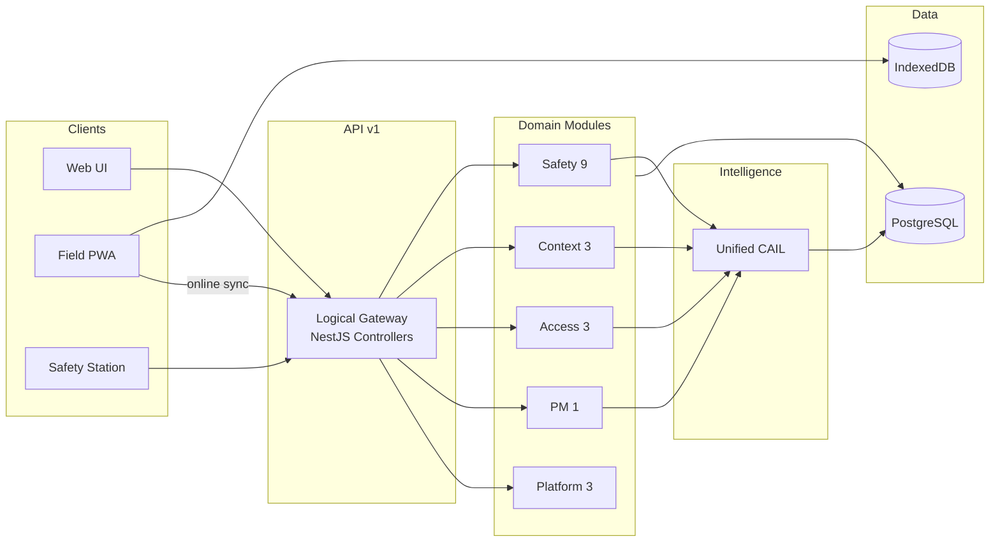

# Vera — Unified Safety, PM, and Intelligence Platform

**Type:** Full system architecture (backend + DB + API + events + CAIL + offline)  
**Scope:** 19 integrated PM safety modules + Vera Core + cross-cutting platform services  
**Stack:** Next.js (`vera-frontend`) · NestJS modular monolith (`backend`) · PostgreSQL (Prisma) · IndexedDB field cache  
**API version:** `/api/v1`

This document maps the **target microservice topology** from the platform spec to the **current Vera implementation**: a domain-oriented **modular monolith** with logical service boundaries, spec-aligned REST aliases, an in-process event bus, a shared CAIL intelligence layer, and a unified offline sync engine.

**Per-module detail:** see `docs/vera-pm-*-developer-pack.md` and `docs/vera-pm-*-system.md` (19 packs).

---

## 1. System topology

### Architecture style (spec → Vera)

| Spec concept | Vera implementation |
|--------------|---------------------|
| Domain microservices | **NestJS modules** under `backend/src/` — one module per domain, exported services for cross-module calls |
| API Gateway + BFF | **`services/api-gateway/`** (port 8080) + NestJS monolith + Next.js BFF via `vera-frontend/lib/*` |
| Event-driven backbone | **`EventBusService`** (in-process); Kafka/RabbitMQ-ready via `DomainEventPayload` contract |
| Centralized Auth/RBAC | **`JwtAuthGuard` + `RolesGuard`** on all PM routes; `companyId` / `projectId` scoping in services |
| Shared CAIL layer | **`PmUnifiedSafetyIntelligenceModule`** + legacy `safety-intelligence/cail` |
| Shared offline engine | **`PmOfflineModeModule`** + `FieldSyncModule` + per-module `*.sync` handlers |

### Core layers

```
┌─────────────────────────────────────────────────────────────────────────┐
│  Presentation: Web (Next.js) · Mobile PWA · Safety Stations · Field UI   │
├─────────────────────────────────────────────────────────────────────────┤
│  API surface: /api/v1/pm/* · /api/v1/core/* · /api/v1/field/*           │
├─────────────────────────────────────────────────────────────────────────┤
│  Domain modules (19 PM safety + JHA/SIF + core)                          │
│    Safety · Context · Access & Field · PM · Platform                     │
├─────────────────────────────────────────────────────────────────────────┤
│  Intelligence: Unified CAIL (predict · score · correlate · recommend)    │
├─────────────────────────────────────────────────────────────────────────┤
│  Offline: IndexedDB queue → sync handlers → module applyOfflineSync      │
├─────────────────────────────────────────────────────────────────────────┤
│  Data: PostgreSQL (Prisma) · object storage (uploads) · module caches     │
└─────────────────────────────────────────────────────────────────────────┘
```

### Domain grouping (19 modules)

| # | Domain | Module | Primary API | Spec alias |
|---|--------|--------|-------------|------------|
| 1 | Safety | JHA / FLHA | `/api/v1/pm/jha-flha` | — |
| 2 | Safety | SIF / HECA | `/api/v1/pm/sif-heca` | — |
| 3 | Safety | Inspections | `/api/v1/pm/inspections` | — |
| 4 | Safety | Incidents | `/api/v1/pm/incidents` | — |
| 5 | Safety | Corrective Actions | `/api/v1/pm/unified-corrective-action` | `/api/v1/pm/corrective-action` |
| 6 | Safety | Unified Hazard & Control | `/api/v1/pm/unified-hazard-control` | `/api/v1/pm/hazard`, `/api/v1/pm/control` |
| 7 | Safety | SDS / Document Control | `/api/v1/pm/document-control` | `/api/v1/pm/sds` |
| 8 | Safety | Emergency Response | `/api/v1/pm/emergency-response` | `/api/v1/pm/emergency` |
| 9 | Safety | Equipment Safety | `/api/v1/pm/equipment-safety` | `/api/v1/pm/equipment` |
| 10 | Context | Company Safety Context | `/api/v1/pm/company-safety-context` | `/api/v1/pm/company/safety` |
| 11 | Context | Project Safety Context | `/api/v1/pm/project-safety-context` | `/api/v1/pm/project/safety` |
| 12 | Context | Worker Safety Profiles | `/api/v1/pm/worker-safety-profile` | `/api/v1/pm/worker/safety` |
| 13 | Access | Site Access Control | `/api/v1/pm/site-access-control` | `/api/v1/pm/access` |
| 14 | Access | Safety Stations | `/api/v1/pm/safety-stations` | `/api/v1/pm/station` |
| 15 | Access | Training | `/api/v1/pm/training` | — |
| 16 | PM | Project Management | `/api/v1/pm/project-management` | `/api/v1/pm/project` |
| 17 | Platform | Attachments & Media | `/api/v1/pm/attachments-media` | `/api/v1/pm/attachment` |
| 18 | Platform | Offline Mode | `/api/v1/pm/offline-mode` | `/api/v1/pm/offline` |
| 19 | Platform | Unified CAIL | `/api/v1/pm/unified-safety-intelligence` | `/api/v1/pm/cail` |

**Auxiliary (not in the 19-pack set):** Safety Meetings (`/api/v1/pm/safety-meetings`), legacy CAPA (`/api/v1/pm/corrective-actions`), legacy VSI (`/api/v1/pm/safety-intelligence/*`), Vera Core (`/api/v1/core/*`).

---

## 2. Service map

### Logical gateway routing (external → module)

Vera exposes a **production API gateway** at `services/api-gateway/` (port **8080**) with JWT, RBAC, and path-based proxying. Client and BFF routing:

| Spec gateway prefix | Vera routes |
|---------------------|-------------|
| `/auth/*` | `/api/v1/auth/*` (monolith) · **`services/auth-service`** (`/auth/*` on port 3001) |
| `/safety/jha/*` | `/api/v1/pm/jha-flha/*` |
| `/safety/sif-heca/*` | `/api/v1/pm/sif-heca/*` |
| `/safety/inspection/*` | `/api/v1/pm/inspections/*` |
| `/safety/incident/*` | `/api/v1/pm/incidents/*` |
| `/safety/corrective-action/*` | `/api/v1/pm/corrective-action/*` (spec) or `/unified-corrective-action/*` |
| `/safety/hazard/*` | `/api/v1/pm/hazard/*`, `/control/*`, `/unified-hazard-control/*` |
| `/safety/sds/*` | `/api/v1/pm/sds/*`, `/document-control/*` |
| `/safety/emergency/*` | `/api/v1/pm/emergency/*`, `/emergency-response/*` |
| `/safety/equipment/*` | `/api/v1/pm/equipment/*`, `/equipment-safety/*` |
| `/context/company/*` | `/api/v1/pm/company/safety/*`, `/company-safety-context/*` |
| `/context/project/*` | `/api/v1/pm/project/safety/*`, `/project-safety-context/*` |
| `/context/worker/*` | `/api/v1/pm/worker/safety/*`, `/worker-safety-profile/*` |
| `/access/site/*` | `/api/v1/pm/access/*`, `/site-access-control/*` |
| `/access/station/*` | `/api/v1/pm/station/*`, `/safety-stations/*` |
| `/access/training/*` | `/api/v1/pm/training/*` |
| `/pm/project/*` | `/api/v1/pm/project/*`, `/project-management/*` |
| `/platform/attachment/*` | `/api/v1/pm/attachment/*`, `/attachments-media/*` |
| `/platform/offline/*` | `/api/v1/pm/offline/*`, `/offline-mode/*`, `/api/v1/field/*` |
| `/cail/*` | `/api/v1/pm/cail/*`, `/unified-safety-intelligence/*` |

### Cross-cutting services

| Spec service | Vera module | Notes |
|--------------|-------------|-------|
| api-gateway | `services/api-gateway/` | Port 8080 — JWT, RBAC, routing to auth/rbac/audit/backend |
| auth-service | `services/auth-service/` (microservice) + `backend/src/auth/` (monolith) | JWT login, refresh, multi-tenant UUID users |
| rbac-service | `services/rbac-service/` + `auth/roles.guard.ts` (monolith) | Roles, permissions, `/rbac/evaluate` |
| audit-service | `services/audit-service/` + per-module `*_audit` tables + `PmOfflineAuditLog` | Centralized append-only audit log, `/audit/event` ingestion |
| offline-sync-service | `services/offline-service/` + `pm-offline-mode/`, `field-sync/` | Cache, conflicts, delta sync, background worker |
| hazard-control-service | `services/hazard-control-service/` + `pm-unified-hazard-control/` | Hazard/control libraries, SIF/HECA, energy wheel, mappings |
| attachment-service | `services/attachment-service/` + `pm-attachments-media/` | Upload, thumbnails, S3 storage, pre-signed URLs |
| cail-core-service | `pm-unified-safety-intelligence/` | Master intelligence layer |
| event-bus | `api-platform/events/event-bus.service.ts` | In-process pub/sub |

### Communication patterns

| Pattern | Use |
|---------|-----|
| **Sync REST** | All CRUD, dashboards, gates, offline bundles |
| **Sync DI** | NestJS `@Optional()` imports between modules (e.g. CAPA ← inspections) |
| **Async events** | `EventBusService.emit(DomainEvent.*)` — training, workers, VSI invalidation, CAIL lifecycle |
| **Schedulers** | `@nestjs/schedule` — CAIL nightly batch, CAPA escalation, offline cleanup |



---

## 3. Master data model

### Tenancy

| Entity | Prisma / table | Scope |
|--------|----------------|-------|
| Company | `Company` | Tenant root; all PM rows include `companyId` |
| Project | `Project` | `companyId` FK; project-scoped safety data |
| Site | `Site` | Optional on projects, JHA, incidents |

### Core entities (shared)

| Spec entity | Vera model | Module ownership |
|-------------|------------|------------------|
| workers | `Worker`, `User` | Vera Core + worker safety profile |
| equipment | `Equipment` | Core + equipment safety |
| hazards | `PmUnifiedHazard` → `hazards` | Unified H&C |
| controls | `PmUnifiedControl` → `controls` | Unified H&C |
| training_courses | `TrainingRequirement`, PM training tables | Training |
| corrective_actions | `PmCorrectiveAction` | Unified CA + legacy CAPA |
| sds_documents | Document control / SDS tables | Document control |
| emergency_events | `PmEmergencyEvent` | Emergency response |
| access_points | `SiteAccessRule`, zones | Site access |
| safety_stations | `PmSafetyStation` | Safety stations |

### Relationship highlights

```
company ──1:N──► project ──1:N──► work_packages, tasks, jhas, inspections,
                                incidents, corrective_actions, hazards, controls

worker ──1:N──► worker_training, authorizations, hazard_exposure,
                corrective_actions (assignee), access_attempts

equipment ──1:N──► inspections, failures, certifications, assignments, capa

hazard ──N:M──► control (hazard_controls)
hazard ──► jha, inspection, incident, capa (sourceModule + links)

corrective_action.sourceModule + sourceId ──► jha_flha | inspection | incident |
                                                equipment | emergency | pm_task | sif_heca
```

### CAIL entities (centralized intelligence store)

| Table | Model | Purpose |
|-------|-------|---------|
| `cail_predictions` | `CailPrediction` | Probabilities (incident, CAPA overdue, project risk, …) |
| `cail_scores` | `CailScore` | Worker / equipment / project / company scores |
| `cail_recommendations` | `CailRecommendation` | Actionable recommendations |
| `cail_correlations` | `CailCorrelation` | Cross-module links |
| `cail_explainability` | `CailExplainability` | Deterministic explanations |
| `cail_models` | `CailModel` | Model registry (`deterministic_rules_v1` default) |
| `cail_model_versions` | `CailModelVersion` | Versioning |
| `cail_model_audit` | `CailModelAudit` | Train / deploy / rollback audit |
| `cail_training_data` | `CailTrainingData` | Feature store for future ML |
| `cail_inference_logs` | `CailInferenceLog` | Every inference run |
| `cail_offline_cache` | `CailOfflineCache` | Offline intelligence bundles |

**Migration chain (PM safety):** `20260521250000` project safety context → `…290000` unified CAIL (see each `docs/vera-pm-*-system.md`).

---

## 4. API gateway and domain APIs

### Auth and RBAC

| Layer | Enforcement |
|-------|-------------|
| Gateway (controller) | `@UseGuards(JwtAuthGuard, RolesGuard)` + `@Roles(...)` |
| Service | `companyId` / `projectId` on every query; worker-scoped reads where applicable |
| Safety gates | CAIL `evaluateSafetyGate`, site access `workerAccessCheck`, unified CAPA enforcement |

**Roles:** `WORKER`, `SUPERVISOR`, `PROJECT_MANAGER`, `COMPANY_ADMIN`, `ADMIN`, `SUPER_ADMIN`  
**Pattern:** Workers read + act on assigned items; supervisor+ create, publish, verify, override.

### Representative API surfaces (by domain)

#### Safety domain

| Module | Key operations |
|--------|----------------|
| JHA/FLHA | CRUD, hazards/controls on JHA, sign, submit, supervisor approve (CAPA gate) |
| SIF/HECA | Event ingest, scoring, corrective action generation |
| Inspections | Templates, run inspection, deficiencies → CAPA |
| Incidents | Intake, RCA, witnesses, SIF ingest, CAPA |
| Unified CA | Create, assign, escalate, verify, batch generate, enforcement |
| Unified H&C | Hazard/control libraries, energy wheel, SIF/HECA, ingest, mapping |
| SDS | Chemical library, acknowledgments, gap CAPA |
| Emergency | Declare, all-clear, post-event CAPA |
| Equipment | Failures, lockout, inspections, CAPA |

#### Context domain

| Module | Key operations |
|--------|----------------|
| Company safety | Profile, libraries, policies, score, import to project |
| Project safety | Profile, zone/equipment/training/emergency rules, publish, enforcement |
| Worker safety | Profile, training sync, authorizations, exposure, compliance gates |

#### Access and field domain

| Module | Key operations |
|--------|----------------|
| Site access | Zone rules, access attempts, denials → CAPA |
| Safety stations | Real-time enforcement API, heartbeat |
| Training | Requirements, gaps, worker training sync |

#### PM domain

| Module | Key operations |
|--------|----------------|
| Project management | Projects, work packages, tasks, assignments, task-start gate (CAPA + CAIL) |

#### Platform domain

| Module | Key operations |
|--------|----------------|
| Attachments | Entity-linked media (evidence, JHA, CAPA, inspections) |
| Offline | Batch sync, conflict resolution, device queue |
| CAIL | predict, score, recommend, correlate, explain, train, deploy, offline infer |

### Frontend clients (`vera-frontend/lib/`)

| Client file | API base |
|-------------|----------|
| `pm-jha-flha.ts` | `/pm/jha-flha` |
| `pm-inspections.ts` | `/pm/inspections` |
| `pm-incidents.ts` | `/pm/incidents` |
| `pm-corrective-action.ts` | `/pm/corrective-action` (spec) |
| `pm-unified-corrective-action.ts` | `/pm/unified-corrective-action` |
| `pm-hazard.ts` | `/pm/hazard`, `/pm/control` |
| `pm-unified-hazard-control.ts` | `/pm/unified-hazard-control` |
| `pm-company-safety.ts` | `/pm/company/safety` |
| `pm-project-safety.ts` | `/pm/project/safety` |
| `pm-worker-safety.ts` | `/pm/worker/safety` |
| `pm-project.ts` | `/pm/project` |
| `pm-cail.ts` | `/pm/cail` |
| `pm-unified-safety-intelligence.ts` | `/pm/unified-safety-intelligence` |
| `field/sync-handlers.ts` | All `*.sync` actions |

---

## 5. Event backbone

### Current implementation

- **`EventBusService`** — in-process, synchronous handlers (extensible to message queue).
- **`DomainEvent`** constants in `domain-events.ts` (worker, equipment, inspection, training, CAIL, sync, VSI).
- **VSI handler** — `VsiDomainEventHandler` invalidates dashboards on safety events.

### Recommended domain events (PM safety extensions)

| Event | Emitters | Consumers |
|-------|----------|-----------|
| `jha.submitted` | JHA module | CAPA auto-gen, CAIL batch |
| `inspection.deficiency_created` | Inspections | CAPA, SIF ingest |
| `incident.reported` | Incidents | SIF, CAPA, CAIL |
| `capa.overdue` | CAPA scheduler | Escalation, site access block |
| `capa.verified` | Unified CA | Close deficiency, unlock equipment |
| `hazard.published` | Unified H&C | Project context, enforcement |
| `access.denied` | Site access | CAPA, CAIL realtime |
| `emergency.declared` | Emergency | Suspend gates, CAIL |
| `cail.inference_complete` | Unified CAIL | Dashboard cache |

**Today**, most cross-module reactions use **direct service calls** (`PmCapaAutoGenerateService`, `PmUnifiedCorrectiveActionService.jhaApprovalGate`) rather than events — events supplement VSI and core platform flows.

---

## 6. CAIL intelligence layer

### Architecture

```
Data ingestion (all modules)
    → Rule engine (violations)
    → Scoring engine (0–100 scores)
    → Predictive engine (probabilities)
    → Pattern recognition (chronic, repeat, drift)
    → Correlation engine (cross-module links)
    → Recommendation engine
    → Explainability engine
    → Safety gating engine (worker / equipment / PM / JHA)
    → Persist: predictions, scores, recommendations, correlations, explainability
    → Audit: cail_inference_logs, cail_model_audit
```

### Entry points

| Trigger | API |
|---------|-----|
| Realtime (access scan, station) | `POST /pm/cail/offline/infer`, `POST …/inference/realtime` |
| Batch (nightly + manual) | `POST …/inference/batch`, scheduler `@02:00` |
| On-demand | `POST /pm/cail/predict`, `/score`, `/recommend` |
| Offline | `GET …/sync/bundle`; upload via `POST /pm/cail/offline/sync` |

### Default model

- **`deterministic_rules_v1`** — auto-provisioned per company; no LLM on enforcement paths.
- Deploy / rollback via `POST /pm/cail/model/deploy|rollback`.

### Module-level CAIL (distributed)

Several modules expose **local CAIL insights** (company/project/worker/JHA/inspections/incidents) that **feed** the unified layer:

- `PmProjectSafetyCailIntelligenceService`
- `PmCompanySafetyCailIntelligenceService`
- `PmWorkerSafetyProfile` CAIL endpoints
- `PmUnifiedHazardControlCailService`
- `PmUnifiedCorrectiveActionCailService`

Unified CAIL **aggregates** project signals in `collectProjectSignals()` and persists to shared `cail_*` tables.

---

## 7. Offline and sync layer

### Client (field PWA)

- **IndexedDB** — `vera-field-cache` (`FIELD_DB_VERSION` 3).
- **Sync queue** — `SyncQueueItem` with `SyncActionType` per module.
- **Handlers** — `vera-frontend/lib/field/sync-handlers.ts`.

### Server

| Component | Role |
|-----------|------|
| `PmOfflineModeService` | Orchestrates batch, conflicts, audit |
| `OfflineBatchRouter` | Routes action type → module `syncOffline` / `applyOfflineSync` |
| Per-module bundles | `buildOfflineBundle` + `applyOfflineSync` on upload |

### Sync action registry (19 modules)

| Sync action | Module |
|-------------|--------|
| `jhaFlha.sync` | JHA/FLHA |
| `sifHeca.sync` | SIF/HECA |
| `pmInspections.sync` | Inspections |
| `pmIncidents.sync` | Incidents |
| `pmUnifiedCorrectiveAction.sync` | Unified CA |
| `pmUnifiedHazardControl.sync` | Unified H&C |
| `pmUnifiedSafetyIntelligence.sync` | Unified CAIL |
| `pmProjectSafetyContext.sync` | Project safety context |
| `pmCompanySafetyContext.sync` | Company safety context |
| `pmWorkerSafetyProfile.sync` | Worker safety profile |
| `pmProjectManagement.sync` | PM |
| `pmTraining.sync` | Training |
| `pmDocuments.sync` | SDS / document control |
| `pmEquipment.sync` | Equipment safety |
| `pmEmergency.sync` | Emergency |
| `pmSiteAccess.sync` | Site access |
| `pmSafetyStations.sync` | Safety stations |
| `pmAttachments.sync` | Attachments |
| `pmOffline.sync` | Offline engine meta |

**Pattern:** Download when payload has only `companyId`/`projectId`; upload when module-specific arrays are present (e.g. `hazards`, `actions`, `predictions`).

---

## 8. Cross-module integration matrix

| Source module | Targets | Integration mechanism |
|---------------|---------|------------------------|
| JHA/FLHA | CAPA, CAIL, H&C | Submit → auto CAPA; `jhaApprovalGate` ← open CAPA |
| Inspections | CAPA, SIF, equipment lockout | Deficiency → `PmCapaAutoGenerateService` |
| Incidents | SIF, CAPA, RCA | `ingest` + root-cause CAPA |
| SIF/HECA | CAPA, JHA gate | High-risk events → CAPA |
| Unified H&C | CAPA, CAIL, JHA | Unmapped hazards → batch CAPA |
| Equipment | CAPA, access, CAIL | Failure → CAPA; lockout until verified |
| Training | CAPA, worker profile, access | Expired training → CAPA + access block |
| Site access | CAPA, CAIL realtime | Denial → CAPA |
| Emergency | CAPA, gating | Active emergency suspends some blocks |
| Company / Project context | H&C import, zones, enforcement | Library import; zone sync to access |
| Worker profile | Access, CAPA, CAIL | Compliance + worker score |
| PM | CAPA, CAIL, task gate | Blocked tasks → CAPA; `pmTaskStartGate` |
| Safety stations | CAIL realtime | `runRealtimeInference` at edge |
| **Unified CAIL** | **All** | Scores, predictions, recommendations, gates |

---

## 9. Enforcement and gating (system-wide)

| Gate | Service | Blocks when |
|------|---------|-------------|
| JHA supervisor approval | `PmUnifiedCorrectiveActionService.jhaApprovalGate` | Open JHA/SIF-linked CAPA |
| PM task start | `pmTaskStartGate` + project management | CAPA / CAIL blocks |
| Worker site access | `PmCorrectiveActionsService.workerAccessCheck` | Overdue/critical CAPA |
| Equipment lockout | Equipment safety + CAPA verify | Open equipment CAPA |
| Unified CAIL gate | `evaluateSafetyGate` | Low scores, SIF hazards, emergency |
| Project/company context | `enforcementGate` on profiles | Unpublished profile, missing rules |

Overrides: `pm_capa_overrides`, `pm_hc_overrides`, project/company safety overrides (time-boxed).

---

## 10. Analytics and observability

| Layer | Source |
|-------|--------|
| Per-module dashboards | Each module `GET /dashboard`, `GET /analytics` |
| Unified CAIL trends | `GET /pm/cail/dashboard`, `/analytics/trends` |
| Leading indicators | CAIL predictions 30d, open recommendations, inference runs |
| Lagging indicators | Scores computed, CAPA closure, incident counts |
| Audit | Module `*_audit`, `cail_inference_logs`, `pm_offline_audit` |
| Phase-1 monitoring | `Phase1MonitoringModule` (platform health) |

---

## 11. Deployment and evolution

### Current deployment unit

- **Single backend** process (all modules in `AppModule`).
- **Single frontend** (Next.js).
- **PostgreSQL** with Prisma migrations.

### Path to spec microservices

| Step | Action |
|------|--------|
| 1 | Extract **read models** per domain (already isolated Prisma models). |
| 2 | Replace DI calls with **HTTP + domain events** per boundary. |
| 3 | Deploy **CAIL** and **offline** as shared services; keep `cail_*` schema. |
| 4 | Add **API gateway** (Kong/AWS) mapping spec prefixes → service URLs. |
| 5 | Back **EventBusService** with Kafka using existing `DomainEventPayload`. |

---

## 12. Quick reference — documentation index

| Module | Developer pack | System doc |
|--------|----------------|------------|
| JHA/FLHA | `vera-pm-jha-flha-developer-pack.md` | `vera-jha-flha-system.md` |
| SIF/HECA | `vera-pm-sif-heca-developer-pack.md` | — |
| Inspections | `vera-pm-inspections-developer-pack.md` | — |
| Incidents | `vera-pm-incidents-developer-pack.md` | — |
| Unified CA | `vera-pm-unified-corrective-action-developer-pack.md` | `vera-pm-unified-corrective-action-system.md` |
| Unified H&C | `vera-pm-unified-hazard-control-developer-pack.md` | `vera-pm-unified-hazard-control-system.md` |
| SDS | `vera-pm-sds-document-control-developer-pack.md` | — |
| Emergency | `vera-pm-emergency-response-developer-pack.md` | — |
| Equipment | `vera-pm-equipment-safety-developer-pack.md` | — |
| Company context | `vera-pm-company-safety-context-developer-pack.md` | `vera-pm-company-safety-context-system.md` |
| Project context | `vera-pm-project-safety-context-developer-pack.md` | `vera-pm-project-safety-context-system.md` |
| Worker profile | `vera-pm-worker-safety-profile-developer-pack.md` | `vera-pm-worker-safety-profile-system.md` |
| Site access | `vera-pm-site-access-control-developer-pack.md` | — |
| Safety stations | `vera-pm-safety-stations-developer-pack.md` | — |
| Training | `vera-pm-training-developer-pack.md` | — |
| PM | `vera-pm-project-management-developer-pack.md` | `vera-pm-project-management-system.md` |
| Attachments | `vera-pm-attachments-media-developer-pack.md` | — |
| Offline | `vera-pm-offline-mode-developer-pack.md` | `vera-pm-offline-mode-system.md` |
| Unified CAIL | `vera-pm-unified-safety-intelligence-developer-pack.md` | `vera-pm-unified-safety-intelligence-system.md` |
| Vera Core | — | `architecture/vera-core-system-blueprint.md` |

---

## 13. End-to-end flows (examples)

### Field worker — FLHA + access

1. Download offline bundles (`pmUnifiedHazardControl.sync`, `pmProjectSafetyContext.sync`, …).
2. Complete FLHA offline → `jhaFlha.sync` upload.
3. Site scan → `POST /pm/cail/offline/infer` (realtime gate).
4. Access granted/denied via site access module; denial may enqueue CAPA.

### Supervisor — inspection deficiency to closure

1. Inspection run → deficiency auto-created.
2. `PmCapaAutoGenerateService.fromInspectionDeficiency`.
3. Assign CAPA → escalate if overdue → verify with evidence.
4. CAIL batch refreshes project score; correlation links hazard ↔ inspection.

### Company admin — intelligence review

1. `GET /pm/cail/dashboard?companyId=1`.
2. `POST /pm/cail/recommend` + review explainability.
3. `POST /pm/cail/model/train` after ingest (feature store).
4. Publish company/project safety profiles; sync libraries to projects.

---

*This architecture reflects the Vera repository as of the integrated 19-module PM safety pack. For API field-level detail, use the per-module developer packs.*
