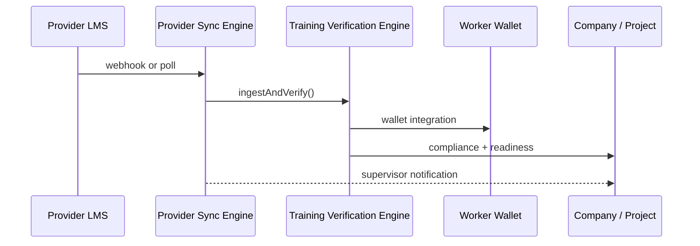

# Worker Wallet & Provider Sync Engine — Integration Guide

## Overview

The **Worker Wallet** surfaces verified training, expiry countdowns, project readiness, QR field scanning, and blockchain credential validation — online and offline.

The **Provider Sync Engine** connects external LMS/training providers, polls for new completions, auto-verifies through the Training Verification Engine, and propagates records to wallets, companies, and projects.

## Worker Wallet API

| Method | Path | Auth | Description |
|--------|------|------|-------------|
| `GET` | `/api/v1/worker-wallet/download` | Public | PWA / mobile download links |
| `GET` | `/api/v1/worker-wallet/me` | JWT | Signed-in worker profile + QR |
| `GET` | `/api/v1/worker-wallet/bundle/:workerId` | JWT | **Offline bundle** (training, readiness, projects, QR) |
| `GET` | `/api/v1/worker-wallet/qr/:workerId` | JWT | Worker verification QR payload |
| `POST` | `/api/v1/worker-wallet/sync/:workerId` | JWT | Profile sync (legacy lightweight) |
| `GET` | `/api/v1/worker-wallet/blockchain/validate/:tokenId` | Public | On-chain credential check |

### QR verification (field scan)

Public verify URLs use unguessable tokens:

- `GET /verify/t/{qrToken}` — anonymous worker card
- `GET /verify/worker/{id}/full` — staff full wallet (JWT)

Blockchain validation:

```http
GET /api/v1/worker-wallet/blockchain/validate/{tokenId}?trainingRecordId=42
```

## Offline sync

### Web PWA (`/wallet/[id]`)

- `useWorkerWalletAutoSync` pulls `GET /api/v1/worker-wallet/bundle/:id` every 60s and on `online` / foreground.
- Bundle cached in encrypted IndexedDB as `workerWalletBundle:{workerId}`.
- Field sync action `wallet.sync` replays bundle fetch through the unified sync queue.

### React Native (`apps/worker-wallet-mobile`)

Expo app screens: Home, Training, TrainingDetail, QR, Readiness.

- `useOfflineSync` — AsyncStorage cache + periodic refresh via `AppState`.
- Env: `EXPO_PUBLIC_API_URL` (defaults to `http://localhost:3001`).

### Field delta bundle

`GET /api/v1/field/delta?companyId=` includes `workerWalletSnapshots[]` — per-worker verified/expiring counts for supervisor field dashboards. Merged into local cache during `applyDeltaSync`.

## Provider Sync Engine API

| Method | Path | Auth | Description |
|--------|------|------|-------------|
| `GET` | `/api/v1/provider-sync/templates` | Admin | Available LMS mapping templates |
| `PUT` | `/api/v1/provider-sync/providers/:id/config` | Admin | Upsert poll/webhook config |
| `POST` | `/api/v1/provider-sync/providers/:id/webhook` | HMAC optional | Push completions from provider |
| `POST` | `/api/v1/provider-sync/providers/:id/poll` | Supervisor+ | Manual poll |
| `POST` | `/api/v1/provider-sync/poll-due` | Admin | Cron-equivalent poll-all |

### Webhook example (generic REST template)

```http
POST /api/v1/provider-sync/providers/3/webhook
X-Vera-Signature: sha256=<hmac>
Content-Type: application/json

{
  "companyId": 1,
  "templateKey": "generic_rest",
  "completions": [
    {
      "email": "alex@example.com",
      "course_code": "FP-101",
      "certificate_number": "FP-2026-001",
      "issued_at": "2026-05-01",
      "expires_at": "2027-05-01"
    }
  ]
}
```

### Poll configuration

```http
PUT /api/v1/provider-sync/providers/3/config
Authorization: Bearer <jwt>

{
  "syncMode": "poll",
  "pollUrl": "https://lms.example.com/api/v1/completions",
  "pollIntervalMinutes": 10,
  "apiKeyEnvVar": "CORNERSTONE_API_KEY",
  "enabled": true
}
```

Scheduler: `ProviderSyncScheduler` runs every 10 minutes (`pollAllDue`).

## Provider API templates

Defined in `backend/src/modules/provider-sync-engine/provider-api-templates.ts`:

| Key | Use case |
|-----|----------|
| `generic_rest` | Standard `completions[]` REST array |
| `cornerstone` | Cornerstone LMS `data.records` |
| `safety_council_csv_json` | Safety council class-list webhook |

## Event bus topics

| Event | When |
|-------|------|
| `wallet.bundle_synced` | Offline bundle downloaded |
| `wallet.synced` | Wallet integration after verification |
| `provider.completion.received` | Single completion ingested |
| `provider.sync.completed` | Poll/webhook batch finished |
| `provider.sync.failed` | Poll/webhook batch failed |
| `training.verification.run` | Full verification pipeline (from engine) |

## Database schema

- `ProviderSyncConfig` — per-provider poll/webhook settings
- `ProviderSyncRun` — audit row per sync batch
- `TrainingVerificationRun` — verification audit (see training verification docs)

Migration: `20260608160000_provider_sync_engine`

## Pipeline flow



## Local setup

```bash
cd backend
npx prisma migrate deploy
npx prisma generate

# Run provider sync scheduler with API
npm run start:dev
```

```bash
cd apps/worker-wallet-mobile
npm install
npx expo start
```

## Related docs

- [Training Verification Engine](./training-verification-engine-integration.md)
- [Vera Navigation Architecture](./VERA-NAVIGATION-ARCHITECTURE.md)
